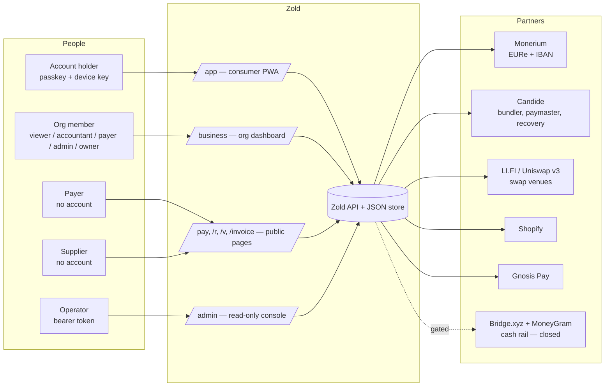
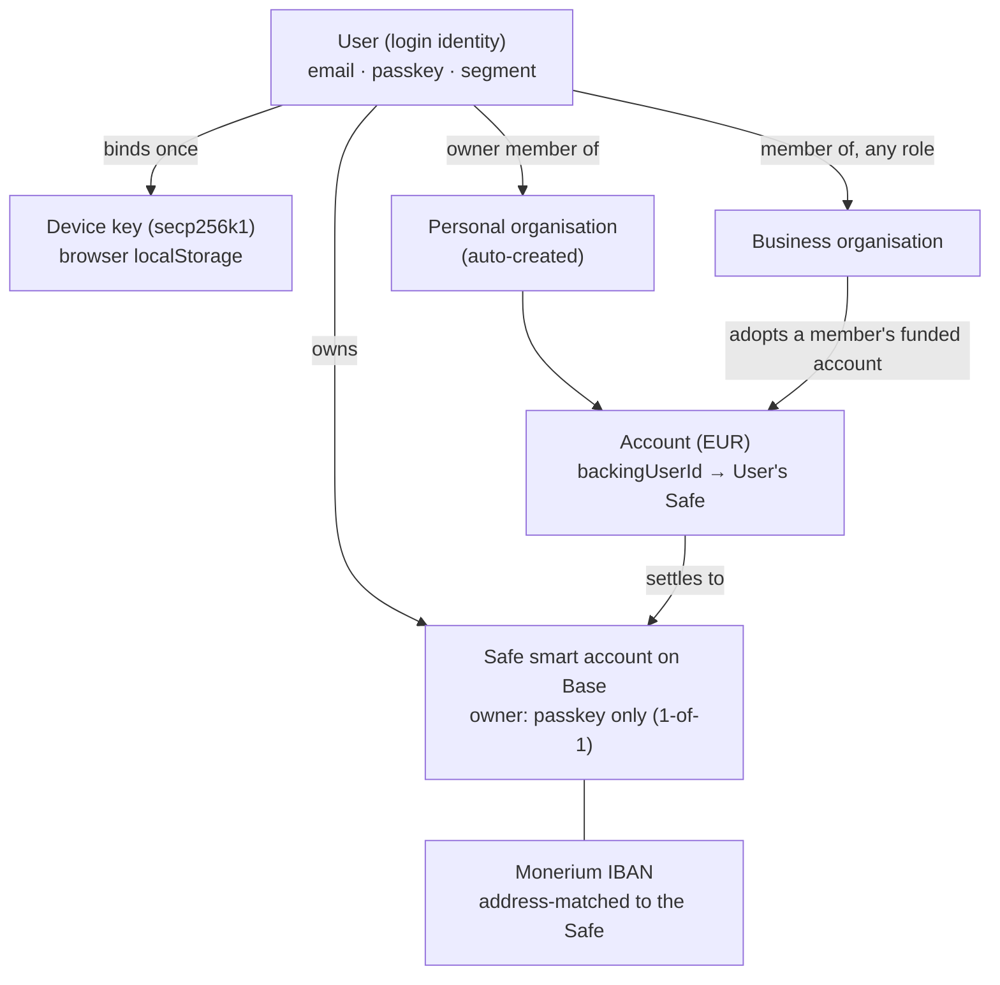
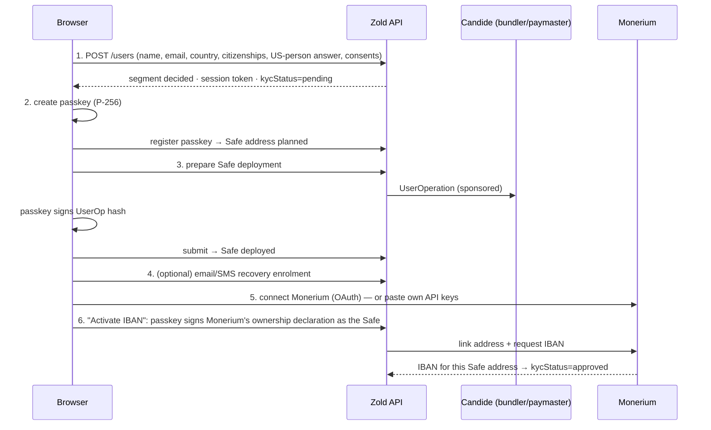
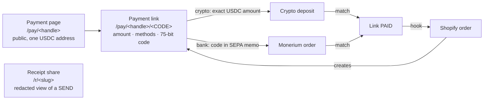
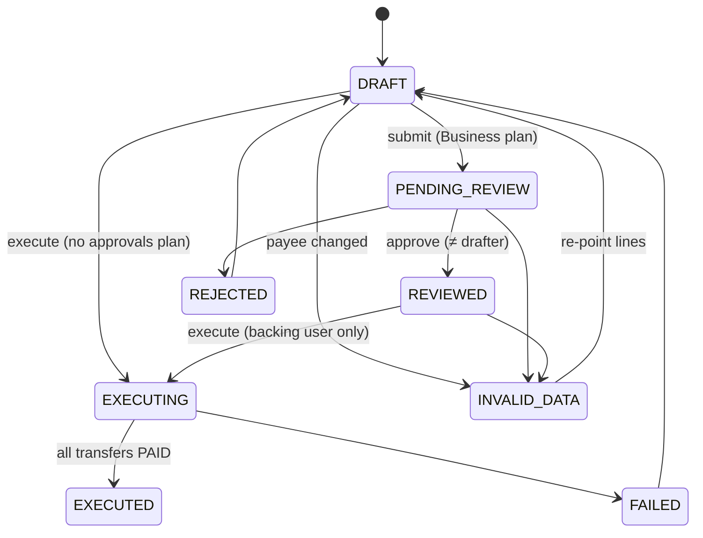

# Zold — product architecture

*Written 2026-09-24 from a line-by-line read of `main` at `8dd8009`, updated
for PR #193 (co-signer retired, `3ba5c5e`). This is the
map of **what the product is made of and how the pieces relate**. Its companion,
[`technical-architecture.md`](technical-architecture.md), covers how each piece
is built. Both are the source for the next GitBook update. Section 12 lists
every place the current GitBook says something the code does not do.*

Every feature below carries one of these statuses, and the status is the point:

| status | meaning |
|---|---|
| **LIVE** | Code path exists, is enforced server-side, and runs on the current deployment (Base Sepolia, Monerium sandbox). |
| **BUILT, UNPROVEN** | Code path exists and is tested offline or against stubs, but has never moved real money or talked to the real partner. |
| **INERT** | Wired end to end but never fed data, so it always shows empty. |
| **GATED** | Deliberately closed. The UI says so and the API refuses. |
| **LABEL ONLY** | A name in a plan, a screen or a doc with no code behind it. |
| **NOT BUILT** | Designed or researched only. |

---

## 1. What Zold is

Zold is a **non-custodial euro account** with a business layer on top. There
are three parts:

1. **The personal account.** It is a smart-contract wallet (a Safe on Base).
   Its owner is a passkey on the user's device. It holds **EURe**, Monerium's
   regulated euro e-money token, and a real **IBAN** issued through Monerium
   is attached to it. SEPA in mints EURe into the wallet, and SEPA out burns
   it.
2. **Getting paid.** There is a public payment page, one-off payment links
   (crypto or SEPA), shareable receipts, and a Shopify connection that marks
   orders paid when the crypto arrives.
3. **The business layer.** An organisation is a tenant with plans, members and
   roles, an address book, payments that go through review, invoicing, and
   bookkeeping.

The brand split: **Zoldenburg** is the company (Zoldenburg UG, Germany), and
**Zold** is the app. The UI uses 🦄 for the narwhal mascot.

### 1.1 The three rules every feature obeys

These come from `CLAUDE.md` and are enforced in code. They are why several
features below are GATED rather than faked.

1. **Nothing renders as real that has not moved real money.** Gated
   currencies, SOON labels, `simulated` badges on receipts and `heldByUs`
   flags all exist for this reason.
2. **Fail closed.** No rate means no quote. No venue means no trade, and Zold
   never falls back to its own book. No Monerium connection means no SEPA
   send, and the send is refused *before* the fee debit.
3. **No debit without a user signature.** The server prepares the operation
   that *is* the debit, and the passkey signs its hash. Zold cannot move a
   user's money on its own.

---

## 2. The actors



| actor | how they get in | what they can reach |
|---|---|---|
| **Account holder** | Passkey sign-in. The session is a bearer token. | Their own account, sends, payment page, links, documents, recovery. |
| **Org member** | The same Zold login, plus an accepted invitation. | The org's screens, filtered by role (§7.3) and plan (§7.2). |
| **Payer** | A public link, with no account. | `/pay/<handle>` and `/pay/<handle>/<code>`. |
| **Supplier** | A one-time Invoice-Me link, optionally password-protected. | `/invoice/<token>`, to fill in and submit an invoice. |
| **Receipt/document reader** | A slug or a verification code. | `/r/<slug>` for a redacted receipt, `/v/<code>` for a verified document. |
| **Operator** | `KYC_OPERATOR_TOKEN` bearer. | A read-only console of users and transactions. It has no write actions. |

---

## 3. The account model



- **A User is a login.** It has name, email, country, passkey, a device key,
  a Safe, and a Monerium connection.
- **The Safe is the account.** Its EURe balance *is* the euro balance. Zold
  keeps no separate ledger of the user's money.
- **The IBAN belongs to the Safe.** Monerium issues it to the Safe's address,
  and Zold only accepts an IBAN whose address matches the user's Safe.
- **An Organisation is the tenant.** Every user gets a *personal* org at
  migration. *Business* orgs are created explicitly. A user can belong to many
  orgs.
- **An org Account is a pointer to one member's Safe.** Per-organisation Safe
  and Monerium provisioning is **NOT BUILT**. A business org's EUR account
  therefore *adopts* a member's personal funded account: same IBAN, same Safe,
  `backingUserId` = that member. Only that member can execute payments from
  it, because only they hold the device key. The same Safe and IBAN show in
  both the personal org and the business org.

---

## 4. Identity, onboarding and security

### 4.1 Onboarding — LIVE on Base Sepolia



1. **Account.** Email is required, because it is the recovery handle. A
   *segment* is decided at signup and is immutable from the client: EU_FULL,
   ONCHAIN_NO_CARD, IN_COLLECTIONS or BLOCKED_*. It drives which partners may
   be called for this user (§4.3). US persons and sanctioned residences are
   refused before any row is created.
2. **Passkey.** There is no skip and no password path.
3. **Safe deployment.** An ERC-4337 Safe is deployed through Candide's
   bundler. Gas is paid per `SAFE_GAS_PAYMENT`: by Candide's paymaster
   (sponsored, which works on Base Sepolia but NOT through the keyless public
   endpoint on Base mainnet), by the Safe in ETH, or by the Safe in USDC. The
   Safe is **1-of-1: the passkey is its only owner.** Zold holds no key that
   can move or block the funds. The 2-of-2 Zold co-signer that Safes had
   before PR #193 is gone, with its key.
4. **Recovery enrolment** is optional and shown only if the deployment has
   `emailSmsRecovery`.
5. **Monerium gate.** The user connects by OAuth (PKCE) *or* pastes their own
   Monerium API keys. There is no white-label path: Zold never creates a
   Monerium profile for anyone.
6. **Activate IBAN.** The passkey signs Monerium's "I hereby declare that I am
   the address owner." as an EIP-1271 Safe message. Zold links the address and
   requests the IBAN. **Only an IBAN matched to the Safe's address approves
   the account.** There is no other KYC provider and no operator approval
   route.

### 4.2 How a payment is authorised

A send needs up to three prompts on the same device:

| signature | what it covers | enforced by |
|---|---|---|
| **Device key** (EIP-712 `PaymentAuthorization`) | Amount, destination commitment (IBAN/phone + name), deadline. | The API process, which verifies it before executing. |
| **Passkey over the Safe UserOperation** | The on-chain debit itself: token, amount, recipient. | The chain. |
| **Passkey over the Monerium redeem message** (SEPA only) | "Send EUR x to IBAN at t". | Monerium, through EIP-1271 against the Safe. |

The device key is a secp256k1 key generated in the browser and bound once
with a passkey step-up. Where the authenticator supports WebAuthn PRF, the key
is wrapped with it. **On the hardware tested, PRF was not supported and the
key is stored unwrapped in localStorage.** That is a known weakness and is
surfaced in the profile.

### 4.3 Segments and partner capabilities — LIVE

| segment | who | partner capabilities |
|---|---|---|
| EU_FULL | EU/EEA, GB and CH residents | monerium, gnosis_pay, safe, card, onchain_balance |
| ONCHAIN_NO_CARD | Monerium will serve, card partner will not | monerium, safe, onchain_balance |
| IN_COLLECTIONS | India | xflow_collections (GATED: needs an Indian entity) |
| BLOCKED_US / BLOCKED_SANCTIONED / BLOCKED_UNSUPPORTED | refused at signup | none |

These are *per-user partner* capabilities. They are separate from the
*per-org plan* capabilities in §7.2.

### 4.4 Recovery

| mode | status | how it works |
|---|---|---|
| **Email/SMS guardian (Candide)** | BUILT, UNPROVEN (stub service only) | Candide becomes a Safe guardian (threshold 1). Lost device: a new passkey is created, an OTP is verified on every registered channel, and Candide executes the recovery on chain. After a grace period (3 days in production) the new passkey becomes the Safe's only owner; a legacy co-signer is not carried over. The old device can veto during the grace period. |
| **Managed KYC guardian** | NOT BUILT beyond the operator workflow | An operator approves, a delay runs, then an external guardian signer would act. That signer does not exist in the repo and nothing finalises a managed recovery. |

The new credential lives on the recovery request, not the user, until the
chain confirms the new owner. Whoever holds the OTP channels therefore cannot
spend during the grace period.

---

## 5. The euro account

### 5.1 Money in

| path | status | what happens |
|---|---|---|
| **SEPA to your IBAN** | LIVE (sandbox) | Monerium mints EURe into the Safe. Zold sees it as an on-chain transfer and as a Monerium order, and records it in the account activity. |
| **EURe sent on chain to the Safe** | LIVE | Recorded as funding, with no conversion. |
| **USDC to the payment page** | BUILT, UNPROVEN | See §6.3 and auto-convert. |

### 5.2 Money out

| rail | status | notes |
|---|---|---|
| **SEPA transfer** | BUILT on Base Sepolia, **never executed end to end** | Monerium *redeems* EURe from the Safe to the payee's IBAN. The principal never passes through Zold, so it is non-custodial. The Zold fee is €0. The payee sees a reference plus "Powered by Zold". |
| **Cash pickup (MoneyGram via Bridge.xyz and a Stellar anchor)** | GATED | Closed unless `BRIDGE_LIVE=1` and an anchor are configured. Quotes answer 503 `RAIL_CLOSED` and the app hides the corridor. It has never run live. |
| **Zold-to-Zold** | NOT BUILT | The "Zold account" option on a pay link opens a pre-filled *SEPA* send. |
| **Crypto out** | NOT BUILT | Marked SOON in the app ("USDC in only, never out"). |
| **UPI** | Deleted | It minted references for money that reached nobody. |

### 5.3 Transfer lifecycle (what the user sees)

SEPA: `CREATED → DEBITED → PAYOUT_SUBMITTED → PAID`, or `FAILED → REFUNDED`,
or `MANUAL_REVIEW`.

Refunds are asymmetric on purpose. Only a clear refusal (a Monerium 4xx, or a
failure before any partner held money) refunds automatically. Timeouts,
duplicates and anything after a partner holds the money go to
**MANUAL_REVIEW**, because refunding money that may also be delivered is worse
than a delay.

### 5.4 Fees, rates and limits

- SEPA fee **€0**. The cash fee is €0.99 plus a 50 bps spread, but that rail is closed.
- Daily send cap **€2,500** per user. It is hard-coded.
- A quote lives for **10 minutes**. The signed authorisation window is 15
  minutes.
- Every venue price is checked against an independent mid-rate from an open
  FX feed, and the quote refuses if the two drift apart.

---

## 6. Getting paid



### 6.1 Payment page — LIVE

The page is a public handle (`/pay/alice`). It shows one USDC receive address
on Base, a QR code and an "Open in wallet" link. It carries no amount and asks
nothing of the payer. The address is a Candide forwarding address into the
user's Safe. Without Candide's forwarding RPC, on non-production only, the
address is the Safe itself. **The address is public.** The page says so and
never claims privacy. The public projection is an allowlist: handle, display
name, address, chain, token and settlement preference. The display name never
defaults to the legal name.

### 6.2 Payment links — BUILT, UNPROVEN on real money

A payment link is one ask against the page. It has a fixed or open amount, a
description, the methods offered (crypto, bank or both) and an expiry (7 days
by default). **The 15-character code is the credential.** Links use the tight
rate bucket, are never cached by the service worker, and a code under the
wrong handle returns 404.

| method | how the payer pays | how Zold matches it |
|---|---|---|
| **Crypto (USDC)** | Send the exact quoted USDC amount to the page address. | By amount. Each open quote on a page gets a distinct micro-unit, so amounts never collide. It tolerates a 50 bps underpay, a partial payment from 20%, and an overpay up to 10%. |
| **Bank (SEPA)** | Pay the IBAN with the code as reference. | The Monerium poller finds the code in the memo. |
| **Zold account** | The app opens a pre-filled SEPA send. | As bank. |

There is no EPC/GiroCode QR. The link becomes PAID when funds reach the
payee's address. Conversion to euros is separate (§6.3).

### 6.3 Crypto in and "auto-convert" — BUILT, UNPROVEN

This feature is the one most often described wrongly, so here is exactly what
it does:

- Zold scans Base for EURe and USDC `Transfer` logs into every user's Safe
  and into payment-page addresses. It waits 2 confirmations and gives each
  USDC deposit an EUR value at arrival from the live mid-rate. That value is
  the tax cost basis. If there is no rate, there is no value, and Zold never
  guesses one.
- **The auto-convert setting** (`paymentPage.autoConvert`) decides whether an
  incoming USDC deposit *waits to become euros* or *settles as USDC*.
- **Zold never swaps on its own.** With auto-convert on, a deposit stays
  **"Awaiting approval"** until the account holder taps *Convert to euro* and
  signs with their passkey. The swap then runs from the user's own Safe back
  into it, through LI.FI or Uniswap. It is refused if the venue rate is more
  than 100 bps off the mid, and the credited EURe is measured, not quoted.
  Realised gain or loss against the arrival value is recorded.
- With auto-convert off, or the settlement asset set to USDC, the deposit is
  marked settled as USDC.

**No swap has ever executed on a real venue.** The mobile crypto screen's
wording ("converted at the live mid rate on arrival") is inaccurate and should
change with the GitBook.

### 6.4 Receipts — LIVE

The sender of a SEPA or cash transfer can publish `/r/<slug>`. The slug is a
75-bit credential and the link lives for 30 days. The sender chooses what
shows: name granularity, account full, short or hidden, FX, rate, reference,
and route. **Redaction is done on the server.** A withheld field is never in
the JSON the page receives. Status is read live from the transfer. Route hops
that were not real are flagged `simulated`.

### 6.5 Shopify — BUILT, UNPROVEN (no app registered, no store installed)

| mode | status | shape |
|---|---|---|
| **custom-app** (default) | BUILT, UNPROVEN | The store adds a manual payment method named "Zold". An `orders/create` webhook opens a crypto payment link. The buyer pays on the Thank-you page extension or through the email link. When the link is PAID, Zold calls `orderMarkAsPaid` and writes a `zold.payment` metafield. |
| **payments-app** | BUILT, approval uncertain | Zold is an offsite payment method inside checkout, with Shopify payment sessions resolved on PAID. It needs admission to Shopify's Payments Apps programme, which is uncertain without a MiCA licence. |

Shopify orders are **crypto only**, because a SEPA transfer cannot land inside
a checkout. They are EUR only. Refund, capture and void are rejected with a
merchant-readable message, and refunds are manual. The checkout extension has
never been built with the Shopify CLI.

**PARKED privacy caveat:** each account has one Safe, so anyone who has paid a
merchant can read every incoming payment and the balance on an explorer. Do
not put Shopify in front of a privacy-sensitive merchant until stealth Safes
exist.

---

## 7. The business layer

### 7.1 Organisations — LIVE

- **Personal** orgs are created automatically for every user. **Business**
  orgs are created by any user, who becomes the owner.
- An org holds a legal name, tax ID, address, reporting currency (the local
  one, or EUR), time zone, FIFO cost-basis method, an invoicing profile, and
  per-capability verification states. An org is never deleted, and no route
  exists to delete one.

### 7.2 Plans and capabilities — LIVE (no billing)

| plan | org types | adds |
|---|---|---|
| **Starter** (free) | personal, business | One account, send and receive, contacts, history, receipts. Business orgs get members (up to 3). |
| **Premium** (paid) | personal only | Multi-currency accounts (5), tagged ledger, export, cost basis, monthly report, invoices. |
| **Business** (paid) | business only | Premium, plus up to 50 members, four-eyes approvals, bulk CSV (500 rows), chart of accounts and rules, and "accounting integrations" (LABEL ONLY). |

- **Gating is a read-time filter, never a delete.** A downgrade pauses
  business features and keeps the data.
- **A trial is a grant with an end date**: 30 days, one per org, ever.
- **There is no billing.** An owner switches plans or starts a trial with a
  click, and nothing charges them.
- `cards` is marked *unavailable* at every price. `integrations.accounting` is
  **not** marked unavailable, so it reports as allowed on Business with nothing
  behind it (§9.3).

### 7.3 Members and roles — LIVE

Three checks guard every org request: **session** (who), **member + role**
(may they, here), and **plan capability** (did the org buy it). A non-member
gets 404, not 403.

| role | summary | can | cannot |
|---|---|---|---|
| **viewer** | read-only | see org, members, accounts, wallets, contacts, drafts, invoices, ledger, chart of accounts; export ledger CSV | change anything; run the monthly report |
| **accountant** | "books, not money" | viewer + categorise/tag ledger, manage chart of accounts and rules, run reports, manage contacts, create and submit drafts, start paying an incoming invoice, import CSV | approve, execute, issue/reconcile/delete invoices, manage members, open accounts |
| **payer** | "money, not books" | viewer + manage contacts, create drafts, execute transfers, manage invoices | approve (even others' drafts), touch the books |
| **admin** | both, plus approval | accountant ∪ payer + org settings, invite/update members, open accounts, manage wallets, **review drafts** | billing |
| **owner** | everything | admin + billing | — |

- **Four eyes:** the reviewer can never be the drafter, whatever their role.
  Editing someone's draft lines makes the editor the drafter.
- **An org can never lose its last active owner**, whether by a role change or
  by deactivation. Only an owner can create or change an owner. Members are
  deactivated, never deleted.
- **Invitations** carry a 3-day, one-time token. The accepting session's email
  must equal the invited email. **No email is sent**, because there is no mail
  transport. The inviter is shown a link to forward.

#### The accountant seat, precisely

| question | answer today |
|---|---|
| How does an accountant get access? | An owner or admin invites them with the role `accountant`. The accountant must create a full Zold account with the same email (passkey + Safe) and accept. There is no guest login, API key or share link. |
| Which plan is needed? | A **business** org. Members only exist on business orgs. The books screens need Business (or a Business trial). On Starter every books screen returns 402. |
| Can they see transactions? | **Not the money movements themselves.** They see drafts (org-originated payments), invoices with their recorded settlements, and contacts. The ledger, which was meant to hold every transaction, **has no writer and is always empty** (§8.3). There is no org-level transfer feed: the `transfers.read` permission exists but no route checks it. The account's transfers live under the backing user's personal session. |
| Can they move money? | No. They can prepare drafts, and someone with `drafts.review` must approve. Only the backing user can execute. |
| Can they close an invoice? | No. Reconcile needs `invoices.manage`. |

### 7.4 Accounts and currencies

| currency | rail | provider | status |
|---|---|---|---|
| **EUR** | SEPA | Monerium (EURe) | **LIVE** |
| USD | ACH / SWIFT | Iron | GATED (access requested, not granted) |
| GBP | Faster Payments | Iron | GATED |
| CHF | SIC | none identified | GATED |
| KES | M-Pesa | Yellow Card | GATED |
| NGN | NIP | Yellow Card | GATED |
| INR | UPI | dLocal | GATED ("a UPI rail without one would be a mock") |

A gated account can still be *opened*. It rests in `gated` with its reason and
what it needs, which keeps the demand signal without implying a balance.

### 7.5 Address book — LIVE

A contact holds wallets and bank accounts, validated per rail: IBAN checksum,
sort code, routing number, M-Pesa and UPI formats. Each payee destination has
a **fingerprint** made of identifier plus holder name.

### 7.6 Payments and approvals (drafts) — LIVE, never moved money end to end



- **INVALID_DATA** comes from payee fingerprints, which are recomputed at
  submit, at review *and* at execution. That closes the gap between approval
  and payment, where an address-book edit could otherwise land.
- Execution plans every line first (all or nothing), checks the balance, then
  creates **one SEPA transfer per line** through the same builder the app
  uses. Nothing moves in that call. Each transfer still needs its own
  signatures.
- Gaps found while reading:
  - The business dashboard's Send appears unable to complete a passkey-Safe
    send, because it does not produce the passkey assertion.
  - On Starter and Premium the UI offers no way to send a draft.
  - Bulk-CSV lines are always wallet destinations, and those are refused from
    an issued account.
  - There is no UI to reject a draft or re-point lines.

### 7.7 Imported wallets — INERT

An org can list external wallets (EOA, Safe or MPC) read-only. They **never
sync**, so their ledger is empty. Drafts sourced from an imported wallet just
echo the lines back as "unsigned".

### 7.8 Operator console — LIVE, read-only

`/admin` shows users, stats, operator gas balances and a merged transaction
feed, with a triage strip for stuck states. It is token-gated and has no write
actions. It does not show organisations, drafts or invoices.

---

## 8. Invoicing, documents and bookkeeping

There are three separate subsystems, and only the first is org-level
invoicing.

### 8.1 Invoices — BUILT (org-level, needs the `invoices` capability)

There is one `Invoice` record with two directions:

| direction | flow | status |
|---|---|---|
| **Incoming (Invoice-Me)** | The org creates a one-time link, optionally password-protected. The supplier fills in the invoice and their IBAN and submits. The org presses Pay, which creates a draft. Four eyes apply, then the transfer runs. The invoice goes PAID when the transfer does. The SEPA reference is "Invoice <no.> <org>". | LIVE up to the draft. PAYING → PAID has never run on a real transfer. |
| **Outgoing (issued)** | The org fills an editor. A live compliance check runs per jurisdiction. Issuing freezes a numbered snapshot and returns a link to a printable A4 sheet. | LIVE. It is not signed, produces no PDF bytes, no e-invoice, and no email. |

```
LINK_CREATED → SUBMITTED → PAYING → PAID → RECONCILED     (+ soft DELETED)
```

- **Compliance** has three rule sets, keyed on the *issuer's* country.
  **DE** is statutory: §14 UStG mandatory fields, 19%/7% rates,
  Kleinunternehmer, Kleinbetrag under €250, §14c. **EU** follows the VAT
  Directive baseline for the other 26 member states. **GENERIC** checks
  structure only. Errors block issuing. Warnings must be accepted and are
  recorded on the invoice.
- **Foreign-currency invoices** freeze an EUR restatement per VAT rate at
  issue. That is required by §16(6) UStG. With no rate, the invoice cannot be
  issued.
- **Getting paid on an outgoing invoice** only *records settlements*:
  - a SEPA credit whose memo names the invoice number,
  - a pay link bound to the invoice (API only, and it currently works only for
    personal-org invoices),
  - or a manual link of a crypto deposit.

  **A recorded settlement does not mark the invoice PAID.** A settled issued
  invoice still reads SUBMITTED, shows OVERDUE after its due date, and has to
  be reconciled by hand.
- **Not built:** credit notes and cancellations, a void state, XRechnung or
  ZUGFeRD, invoice signing, PDF generation, email delivery.
- **Product decision on record:** Zold pays from invoices and keeps the
  record, while invoicing software creates, chases and books them. The
  issued-invoice module is meant to be capped, not extended.

### 8.2 Account documents — LIVE (user-level)

A user can generate a **receipt** (for a PAID SEPA transfer), a **statement**
(for a period), a **balance confirmation** and a **proof of ownership**, which
can additionally be signed by the Safe with the passkey. Each document is:

- a frozen snapshot, signed by the Zold document key;
- published at `/v/<CODE>`, with a 15-character code;
- **re-verified on every visit**: signature, a chain re-read of the balance,
  statement reconciliation, and the Safe's EIP-1271 signature.

A revoked document still resolves but shows as failing verification. These
belong to a *user's* account, not an org. Only the account holder can create
them.

### 8.3 Bookkeeping — INERT

The machinery exists and is tested with fixtures:

- **Chart of accounts:** one generic, Xero-style starter chart (1000 cash …
  4000 sales … 6010 gas fees). **Not SKR03/SKR04.** Accounts can be added.
  They cannot be renamed or archived through any route.
- **Rules:** default, asset, wallet or contact scope, most-specific wins.
  A human categorisation is never overwritten by a rule.
- **Ledger:** entries carry direction, asset, amount, fiat value and rate,
  counterparty, account code, tags and note.
- **Assets:** FIFO lots per asset, disposals, realised gain, shortfalls.
- **Monthly balance report**, with CSV output.
- **Ledger CSV export**, with generic columns and a CSV-injection guard.

**Nothing in production ever writes a ledger row.** `store.addLedgerEntries`
has no caller. Transfers, Monerium orders, crypto deposits, invoice
settlements and imported wallets all bypass the ledger. So Transactions,
Assets, the monthly report and the export are empty on every real
deployment. Connecting the account's real activity to the ledger is the single
biggest gap between the business layer as marketed and as built.

### 8.4 Connectors to external accounting software — NOT BUILT

| target | what exists |
|---|---|
| Generic CSV | **BUILT.** Ledger export and monthly-balance CSV, both empty in practice (§8.3). |
| Xero / QuickBooks | **LABEL ONLY.** The plan capability `integrations.accounting` is named "Xero and QuickBooks". There is no client, no OAuth and no route. |
| Lexware Office (lexoffice) + GetMyInvoices | **RESEARCHED.** `docs/getmyinvoices-lexoffice.md` holds a staged plan: push receipts and statements to GetMyInvoices `/documents`, and push bank lines to GetMyInvoices transactions, which leave as MT-940 into Lexware. Lexware's API has no bank-transaction resource. No code, credential or call exists. |
| DATEV | **NOT BUILT.** Mentioned only as a GetMyInvoices MT-940 target. There is no EXTF export. |
| sevDesk | **OUT OF REPO.** A separate sibling project mirrors Monerium orders into sevDesk. It is not wired here. |

---

## 9. Add-ons

| add-on | gated by | status |
|---|---|---|
| **Gnosis Pay card** | user segment (`gnosis_pay`, EU_FULL only) | BUILT, UNPROVEN, read-only. The user signs in with their own browser wallet (SIWE on Gnosis Chain) and sees balances, cards and transactions. Zold never stores the token. Sign-up, KYC, card issuance and funding are not built. |
| **Privacy Bundle** (eSIM + VPN) | per user, KYC approved | Subscriptions are recorded as `pending_fulfillment` until both partners (Kokio, Mysterium) are live, which they are not. |
| **Zold card (Immersve)** | — | NOT BUILT. Proposal only. `cards` is unavailable in every plan. |

---

## 10. Surfaces

| URL | who | what |
|---|---|---|
| `/` | public | Marketing landing page |
| `/app` | account holder | Consumer PWA with onboarding, home, send, activity, payment page and links, documents, profile, recovery and card. Installable, and works offline for the shell. |
| `/business` | org member | Org dashboard: overview, accounts, payments, invoices, Shopify, contacts, wallets, transactions, assets, chart of accounts, members, settings |
| `/pay/<handle>` | payer | Payment page |
| `/pay/<handle>/<code>` | payer | Payment link, which also serves as the payer's receipt |
| `/r/<slug>` | anyone with the link | Redacted transfer receipt |
| `/v/<code>` | anyone with the code | Verified account document |
| `/invoice/<token>` | supplier / customer | Invoice-Me form, or an issued invoice sheet |
| `/admin` | operator | Read-only console |
| Shopify Thank-you and Order-status blocks | buyer | Payment instructions with live status |

---

## 11. What has never run

These are things to say plainly in the GitBook rather than let the product
imply:

- No mainnet deployment. The running deployment is Base Sepolia with the
  Monerium sandbox, at zoldhq.com behind a Cloudflare tunnel.
- No real money has moved through a swap, and no Base Sepolia send has
  executed the debit.
- The cash rail has never opened.
- No Monerium production OAuth app is registered, and no real
  client-credentials token has been used.
- No Shopify app is registered and no store has installed one.
- No Candide recovery service has been called. No real OTP and no on-chain
  guardian action have happened.
- No mail transport exists. Invites, invoice links and recovery emails are
  never sent by Zold.
- Imported wallets never sync, and the ledger is never written.
- No billing is taken for paid plans.
- PWA install on iOS is untested. The device key lives in localStorage, which
  a home-screen app may not share with Safari.

---

## 12. GitBook drift — what to fix in `docs/gitbook/`

Each item is a statement in the current GitBook or product copy that the code
does not support.

| page | says | code |
|---|---|---|
| `README.md` | "Incoming crypto converts to euros with your passkey when you switch auto-convert on." | Accurate. Keep it, and make the crypto screen match. |
| `README.md`, `bookkeeping/*` | Bookkeeping with tags, chart of accounts, cost basis and export "to your accountant's software" | All INERT (no ledger writer). The only export is a generic CSV. |
| `bookkeeping/export-and-integrations.md` | "Direct sync to Xero and QuickBooks is rolling out… Settings → Integrations… each sync is logged" | No integration code and no Integrations settings. |
| `bookkeeping/export-and-integrations.md` | Export includes "every transaction in the current filter", wallet and realised gain | Export is the whole ledger with fixed columns and no wallet or realised-gain column. |
| `bookkeeping/chart-of-accounts.md` | Rename, extend or retire accounts | Only "extend" exists. There are no rename or archive routes and no rule UI. |
| `bookkeeping/assets-and-reports.md` | Positions "per asset per wallet"; month-end values "at month-end rates" | Positions are per asset. Values are the running sum of historic fiat value, not a month-end valuation. |
| `invoicing/issue-an-invoice.md` | Credit notes referencing the corrected invoice | Not built. There is no credit-note type. |
| `invoicing/issue-an-invoice.md` | VAT rate per line; toggles per invoice; pick a contact | The API has per-line VAT but the UI does not. Toggles are org defaults only. Picking a contact prefills name and country only. |
| `invoicing/vat-and-jurisdictions.md` | "Under the structural rule set there is no built-in list" | GENERIC offers `export_third_country` and `other`. |
| `docs/business-accounts.md` (role table) | Owner may delete the org | No delete route exists, by design. |
| `business/accounts-and-currencies.md` | USD accounts "through Bridge" | The currency registry names **Iron** as the USD/GBP provider. Bridge appears in code only as the cash-rail transfer seam. |
| `business/bulk-payments.md` | CSV destination "an IBAN, or a wallet address"; Payments → New draft → Import CSV | The importer produces wallet lines only (`chainId: 0`), and wallet lines are refused from an issued account. There is no Import CSV button in `/business`. The API parses and returns lines but does not create a draft. |
| `business/imported-wallets.md` | "its balance shown"; history and backfill on Premium/Business | Nothing reads an imported wallet's balance or history. `sync.status` stays `pending` forever. |
| `business/payments-and-approvals.md` | Send from the business dashboard | Send from `/business` does not yet produce the passkey assertion a Safe debit needs. There is no reject or re-point UI. |
| `get-paid/payment-page.md` | QR on the page | The QR image route is currently unreachable: it is shadowed by the payment-link route (see the technical doc). |
| `add-money/crypto-deposit.md` and app copy | Converted "at the live mid rate on arrival" | Converted on passkey approval, at the venue's rate, checked against the mid. |
| `landing.html` | "Live on Base" | Base Sepolia only. (The "custodial in practice" footnote was fixed in PR #193.) |
| Plans copy | Business includes "accounting integrations" | LABEL ONLY. It should be marked unavailable or removed. |
