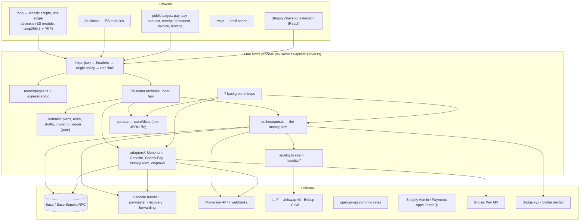
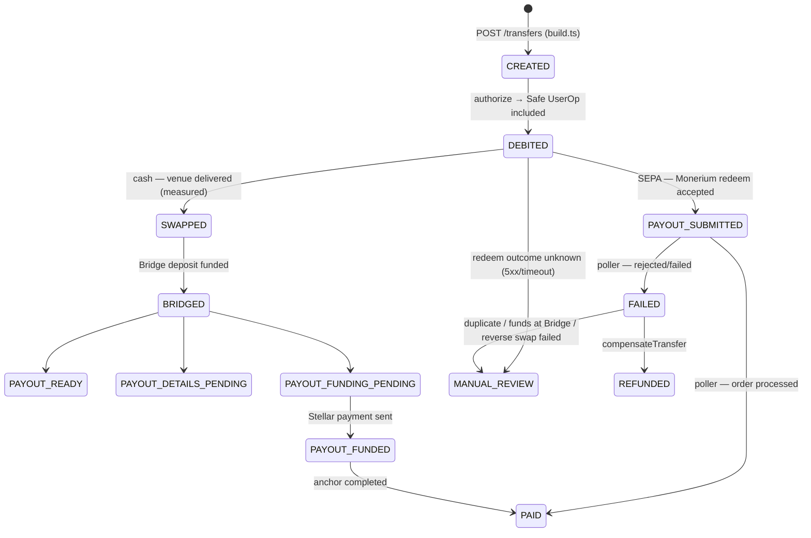
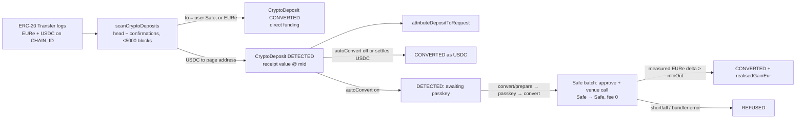

# Zold — technical architecture

*Written 2026-09-24 from a line-by-line read of `main` at `8dd8009`, updated
for PR #193 (co-signer retired, `3ba5c5e`). Companion
to [`product-architecture.md`](product-architecture.md), which covers what the
product is. This document covers how it is built. File references are
`path:line` at that commit, and paths under `services/api/src/` are written
without that prefix. Where this contradicts `docs/notes/`, this was read from
code, and §19 lists the stale text.*

---

## 1. System at a glance



- **One process.** It serves the UI, the API and every background loop, and
  keeps the whole database in memory. Several things assume a single instance:
  WebAuthn challenges, in-flight ceremonies, rate-limit counters, Shopify
  install nonces and pending conversions are all process memory. That is a
  deliberate simplification, and it is the first thing to change before
  running more than one instance (§18).
- **No build step.** TypeScript runs through `tsx`. The browser code is served
  as written: classic scripts for `/app`, ES modules for `/business`, and
  vendored `@noble` crypto.
- **Few dependencies.** `express`, `viem`, `abstractionkit` (Candide Safe /
  ERC-4337), `safe-recovery-service-sdk` and `@stellar/stellar-sdk`. There is
  no DB driver, no helmet/cors/rate-limit package, no WebAuthn library (the
  verifier and CBOR decoder in `webauthn.ts` are hand-written) and no test
  framework (`node:assert` plus scripts).

---

## 2. Repository layout

| path | contents |
|---|---|
| `services/api/src/server.ts` | Wiring only (~350 lines): middleware, router mounts, startup checks, loops. **Owns authentication.** Every router is a factory handed `requireSession` / `requireUserSession`. |
| `services/api/src/http/` | `policy.ts` (origin allowlist, security headers, rate buckets), `sessions.ts` (bearer sessions), `guards.ts` (KYC, custody, segment capability, daily cap, operator), `pending.ts` (in-memory ceremony maps). |
| `services/api/src/routes/` | One router per subject. `routes/business/` splits the org surface: `drafts`, `invoices`, `invoicing`, `invoice-links`, `bookkeeping`, `shared`, `state`. |
| `services/api/src/domain/` | Pure rules with no HTTP and no chain: `plans`, `roles`, `segments`, `residency`, `accounts` (currency registry), `contacts`, `drafts`, `invoices`, `invoicing`, `jurisdictions`, `ledger`, `coa`, `passwords`, `types`. |
| `services/api/src/transfers/build.ts` | **The one path that builds a transfer.** It is shared by `POST /api/transfers` and draft execution. |
| `services/api/src/orchestrator.ts` | Execution, debit, compensation and sweeps. Deliberately not split, so it can be read top to bottom. |
| `services/api/src/liquidity.ts` + `liquidity/` | The venue seam, and one file per venue (`best`, `lifi`, `uniswap`, `rfq`, `cow`, `fx-swapper`, `contract`). |
| `services/api/src/adapters/` | Monerium (client, connection, tokens, "sandbox" poller), Candide forwarder, crypto deposits, Gnosis Pay, MoneyGram. |
| `services/api/src/wallet/` | `candide.ts` (Safe accounts, UserOps, EIP-1271 messages, recovery txs), `passkey-safe-plan.ts`. |
| `services/api/src/recovery*`, `recovery/` | Managed and Candide guardian recovery. |
| `services/api/src/stellar/`, `bridge/` | The cash rail: SEP-10/12/24, SEP-9, and Bridge transfers. |
| `services/api/src/shopify/` | Admin/Payments GraphQL client, HMAC, types. |
| `services/api/src/store.ts`, `store/` | `store.ts` holds the methods and is the only code that touches `db`. `store/db.ts` handles load, migrate and persist. `store/types.ts` holds the row shapes. |
| `services/api/src/config.ts` | Every setting, and every production refusal, in one file (~970 lines). |
| `services/api/public/` | `index.html` + `app/*.js` (consumer), `business.html` + `business/*.js`, `admin.*`, public pages, `sw.js`, `device.js`, `vendor/`. |
| `shopify-app/` | Shopify CLI project: `shopify.app.toml` and the `zold-pay` checkout UI extension. |
| `contracts/src/` | `FxSwapper.sol`, `AdminTimelock.sol`, `MockToken.sol`. **Hardhat fixtures only.** On a real chain Zold deploys nothing. |
| `scripts/` | `dev.ts`, `deploy.ts`, `check.ts`, `reconcile.ts`, about 45 test suites, and setup and probe scripts. |

---

## 3. Request pipeline

Order in `server.ts`:

1. `express.json({limit: 64kb, verify})` keeps `req.rawBody` for the Monerium
   and Shopify HMAC checks (`server.ts:59-64`).
2. `securityHeaders` sets `referrer-policy: no-referrer` and
   `x-content-type-options: nosniff` (`http/policy.ts:36-40`). It sets **no
   CSP, HSTS or frame-ancestors**. TLS and HSTS come from the Cloudflare edge.
3. `originPolicy`: an allowlisted `Origin` gets CORS headers. A foreign
   `Origin` on any non-GET request gets 403. A request with no Origin passes,
   which covers webhooks and curl.
4. `trust proxy` is set to `TRUSTED_PROXY_HOPS` (1 behind the tunnel).
5. `/api` rate limit: fixed 60 s windows keyed on IP (IPv6 per /64). There are
   two buckets. **auth** (20/min) covers `/passkey*`, `/webauthn/challenge`,
   `/recovery*`, `/r/`, `/v/`, `/pay/<h>/<code>`, `/shopify/`, `/admin*`,
   `/invoice-links/`, `POST …/monerium/api-keys` and `POST /users`. **general**
   (300/min) covers everything else. Matching uses the mount-relative path.
6. The page router serves the HTML routes, then `express.static(public)`. It
   is mounted before any `/api` router.
7. Routers are mounted at `/api`. Mount order matters (see §19 for the QR
   route).
8. The error handler returns 500 `internal server error`. The raw message is
   shown only when running locally and not in production.

`unhandledRejection` and `uncaughtException` log and **exit the process**.
With in-memory pending executions, an unknown state must not keep signing.

---

## 4. Authentication and authorisation

### 4.1 Sessions

- A session token is an opaque 32-byte base64url bearer
  (`http/sessions.ts:22-30`). The server stores only its SHA-256 hash. The TTL
  is a fixed 24 h (`SESSION_TTL_MS`) with no sliding renewal. `lastUsedAt` is
  written at most once a minute.
- The token travels in the `Authorization: Bearer` header only. There is no
  cookie session. The client keeps it in `localStorage["zold-session"]`.
- Sessions are issued at signup (before any passkey exists), at passkey
  login, and at Candide recovery finalisation.
- `requireUserSession(req, res, userId)` adds a check that the session user is
  the path user. Org routes use `resolveOrg`, which checks session plus
  **active** membership and returns 404 otherwise.
- The operator uses `KYC_OPERATOR_TOKEN` (at least 24 characters) as a bearer,
  compared in constant time. If it is unset the console answers 503 (fails
  closed). It is never a user session.

### 4.2 The three independent checks

| check | where | failure |
|---|---|---|
| who (session) | `http/sessions.ts` | 401 |
| may they, here (member + role → permission) | `routes/org-context.ts` + `domain/roles.ts` | 404 non-member, 403 missing permission |
| did the org buy it (plan capability, limits) | `domain/plans.ts` via `requireCapability` / `requireWithinLimit` | 402 with `requiresPlan`, or 409 `unavailable` |
| may this user use this partner (segment) | `domain/segments.ts` via `http/guards.ts:76-91` | 403 `CAPABILITY_UNAVAILABLE` (audited) |

Permissions are `org.*`, `members.*`, `accounts.*`, `wallets.*`,
`contacts.*`, `drafts.{read,create,review}`, `transfers.{read,execute}`,
`invoices.*`, `ledger.{read,categorise}`, `coa.*` and `reports.run`. Role
sets are cumulative (`domain/roles.ts:39-86`). `transfers.read` and
`org.delete` are defined but checked by no route.

### 4.3 WebAuthn (`webauthn.ts`)

- ES256 and RS256 are verified. The client only requests ES256, and a Safe
  owner must be P-256.
- Challenges are 32 random bytes, single-use, with a 5-minute TTL and at most
  50k held in memory. Each is bound to a **purpose** (`register` / `login` /
  `step_up`) and optionally to a user or `recovery:<id>`.
- Registration checks type, challenge, origin allowlist, rpIdHash and the UP
  flag. **Attestation statements are not verified**, so any authenticator is
  accepted.
- Assertion requires UV only for `step_up` and for challenges the server
  computed itself (Safe op hashes, SafeMessages). Login uses UV "preferred".
  The sign counter must advance once it is non-zero.
- `verifyAssertionForChallenge` compares `clientData.challenge` with a
  server-computed hash: a UserOp EIP-712 hash or a SafeMessage hash. That is
  how "the passkey signed *this* debit" is proven server-side before the
  bundler sees it.

---

## 5. Custody: the Safe and the device key

### 5.1 Safe smart account (`wallet/candide.ts`, `wallet/passkey-safe-plan.ts`)

- The account class is abstractionkit's `SafeMultiChainSigAccountV1`
  (ERC-4337), created with `initializeNewAccount([owners], {threshold})`, so
  its address is deterministic and counterfactual.
- **Owner 1** is the passkey, as a WebAuthn owner `{x, y}` taken from the
  P-256 JWK.
- **New Safes are 1-of-1**: the passkey is the only owner (PR #193). No
  allowance module is installed; the allowance-module address is kept only to
  read and revoke legacy allowances.
- **Legacy 2-of-2 Safes** (deployed before PR #193) list the retired Zold
  co-signer EOA as a second owner, with threshold 2. They keep working while
  `CANDIDE_COSIGNER_ADDRESS` / `_KEY` are set, and the server counter-signs
  their UserOps and Safe messages. `POST /users/:id/passkey-safe/cosigner-removal[/:requestId]`
  prepares `removeOwner(prev, cosigner, 1)` as a passkey-signed operation,
  which the co-signer counter-signs one last time. The plan changes only after
  `getOwners`/`getThreshold` confirm it on chain. It is refused while a
  recovery is open. At startup `server.ts` names every account still on
  2-of-2, and errors if the key they need is missing. No removal has executed
  on a real chain.
- An optional managed-recovery guardian goes through a SocialRecoveryModule
  (After3Days by default).
- The Safe is deployed as the `initCode` of its first UserOperation. The
  bundler and paymaster default to `https://api.candide.dev/public/v3/<chainId>`
  with an ERC-7677 paymaster, so the user needs no gas. The passkey signs
  `getUserOperationEip712Hash(op, chainId)`. `submitPasskeySafeOperation`
  assembles the signers (the passkey assertion, plus the co-signer on a legacy
  2-of-2 Safe), sends the op, and
  **blocks the HTTP request until the op is included**.
- EIP-1271 messages (`signMessageAsPasskeySafe`) are used for the Monerium
  link declaration, the Monerium redeem order, the Candide SIWE registration,
  and proof-of-ownership documents.
- Local hardhat has no bundler, so Safe deployment is impossible there, and
  the API answers 409 naming the mismatch. `HARNESS.enabled`
  (`LOCAL_HARNESS=1` on 31337 and not production) fakes the op hashes.

### 5.2 Device key (FP4, `public/device.js`)

- A secp256k1 key is generated in the browser and stored in
  `localStorage["zold-device-key"]`. It is wrapped with AES-GCM under
  HKDF(WebAuthn PRF output, salt `"zoll/device-key/v1"`) where PRF exists, and
  stored as a plaintext hex key where it does not. **Do not rename the salt**:
  it is a KDF input.
- It is bound once through `POST /users/:id/authorizer` with a passkey
  step-up. Binding is trust-on-first-use and there is no rotation route.
  Recovery finalisation clears it.
- It signs EIP-712 `PaymentAuthorization {account, amount, to, transferId,
  destination, deadline}` under the domain `{name: "TransF Safe Transfer",
  version 1, chainId, verifyingContract: user Safe}` (`chain.ts:203-238`).
  `destination` is `keccak("sepa|iban=<IBAN>|name=<NAME>")` or the cash
  equivalent. The browser recomputes it and **refuses to sign** if the
  server's typed data names a different destination.
- It is verified **in the API process** (`orchestrator.ts:202-239`), not on
  chain: the RemitVault contract that enforced it was deleted in August 2026.
  The chain-enforced guarantee is the passkey-signed UserOp.

---

## 6. The transfer engine

### 6.1 States



`store.updateTransfer` refuses to move a `PAID` or `REFUNDED` transfer to any
other state. It drops the `state` field and logs.

### 6.2 Quote → build → authorize → execute

```mermaid
sequenceDiagram
  participant B as Browser
  participant A as API
  participant C as Candide bundler
  participant M as Monerium
  B->>A: POST /quotes {rail, sendEur}
  A-->>B: quote (10 min TTL; SEPA: 1:1, fee €0)
  B->>A: POST /transfers {quoteId, recipient, IBAN, reference}
  Note over A: build.ts: KYC · balance · Safe active · device key bound<br/>holdDailyCap (sync) · consumeQuote (sync)<br/>auth terms {to, amountWei, destination, deadline+15m}<br/>prepare UserOp (fee transfer, or fee+approve+swap batch)<br/>pendingTransferExecutions[id] (memory)
  A-->>B: transfer + authorization {typedData, safeExecution.challenge, moneriumRedeem.challenge}
  B->>B: device key signs typedData
  B->>B: passkey signs safeExecution.challenge
  B->>B: passkey signs redeem SafeMessage (SEPA)
  B->>A: POST /transfers/:id/authorize
  Note over A: verify execution assertion BEFORE claim<br/>verify redeem assertion → EIP-1271 sig<br/>claimAuthorization (sync, one-shot)
  A->>A: assertDeviceAuthorization (EIP-712)
  A->>C: submit user-signed UserOp
  C-->>A: included → DEBITED
  A->>M: placeOrder(kind: redeem, signature) → PAYOUT_SUBMITTED
```

Build order (`transfers/build.ts:85-411`) runs in this sequence:

1. KYC approved, then Safe balance ≥ send, then `safeDebitBlocker` (an active
   passkey Safe equal to `user.address`, and the co-signer key present only
   for a legacy 2-of-2 Safe), then the early daily-cap check.
2. Device key bound, then `holdDailyCap` (synchronous, taken *before* the
   quote is consumed), then `consumeQuote`.
3. The debit is prepared. **SEPA debits only the fee (€0), so the principal
   is burned by Monerium straight from the Safe.** Cash tries a fused batch
   first: fee transfer, `approve(spender the venue names)`, and a venue call
   delivering USDC to the Bridge deposit address. It falls back to a full
   debit to the orchestrator (`custody: orchestrator`, which
   `REQUIRE_NON_CUSTODIAL=1` turns into a 409).
4. `transfer.custody = {mode, reason?, feeToOrchestrator}` is always recorded.

Draft execution calls the same `buildTransferFromQuote`, which the business
router receives injected and never rebuilds.

### 6.3 Compensation (`orchestrator.ts:382-622`)

- `failAndCompensate` writes FAILED. It escalates to **MANUAL_REVIEW** on a
  duplicate-debit error or once any `bridge.xyz.deposit.*` step exists.
  Otherwise it compensates.
- `compensateTransfer`:
  - If no input moved, it records a zero refund.
  - If the funds are un-swapped, it returns `min(refund, moved)` EURe to the
    Safe. The `safe.refundTransfer` step is recorded *before* REFUNDED is
    written.
  - If the funds were swapped (non-batch), it reverse-swaps and returns the
    measured EURe.
  - A live batch swap, or any failure of the above, goes to MANUAL_REVIEW.
- SEPA: a Monerium **4xx** refunds the fee. A **timeout or 5xx** goes to
  MANUAL_REVIEW ("redeem outcome unknown").
- Sweeps:
  - `sweepStrandedTransfers` runs at boot and every 5 min. It re-fails
    DEBITED/SWAPPED/BRIDGED transfers that are stale (more than 10 min) and
    not executing, and sends to MANUAL_REVIEW a CREATED transfer whose
    authorisation was claimed more than 10 min ago.
  - `sweepAnchorPayouts` runs every 30 s.

### 6.4 Invariants encoded here

- A **debit only happens with a user signature**: the passkey signs the
  UserOp hash, and the chain enforces token, amount and recipient.
- **Quote binding**: `assertQuoteRateBinding` refuses when the live venue rate
  drifts more than 50 bps from `lockedSwapRate`. In the batch path it runs
  before the debit. In the non-batch path it runs after, so a drift there
  refunds.
- **Amounts out are measured** as balance deltas (`balanceAfterWrite`,
  12 × 500 ms against RPC replica lag). The exceptions are the hardhat-only
  fx-swapper and non-batch `usdcOut` (§19).
- **Races are closed synchronously** by `claimAuthorization`,
  `claimDraftExecution`, `holdDailyCap`/`addTransferUnderHold`,
  `consumeQuote` and the crypto-deposit identity (`txHash`, `logIndex`). There
  is no `await` between read and write.

---

## 7. FX and liquidity

- **Mid rates** (`rates.ts`) come from `TRANSF_RATES_URL` (default
  open.er-api.com, base EUR). They are cached for 10 minutes, concurrent
  callers share one fetch, and the timeout is 8 s. **There is no stale
  fallback**: an error throws `RateUnavailableError`. Pinned rates
  (`TRANSF_RATES_FIXED`) are refused in production.
- **Sanity**: `assertPriceSane` (`dex.ts:135-159`) refuses a venue price more
  than `DEX_MAX_MID_DEVIATION_BPS` (300) from the mid. It is applied to
  uniswap, lifi, rfq and cow. Crypto-in conversion uses a tighter 100 bps.
- **Venue seam** (`liquidity.ts`): `providerById` **throws** on an unknown id
  and never falls back. A persisted quote is executed on the venue that
  priced it. The default is `LIQUIDITY_PROVIDER=best` over `lifi,dex`.

| venue | quote | execute | Safe-executable | guard |
|---|---|---|---|---|
| **lifi** | `GET li.quest/v1/quote` | approve `approvalAddress` (what LI.FI names), send tx, measure | yes | `LIFI_CONTRACTS` allowlist (Diamond), `value == 0` |
| **dex** (Uniswap v3) | deepest pool across fee tiers, QuoterV2 | `exactInputSingle` via SwapRouter02, measure | yes | router is config, pool pinned on quote |
| **rfq** (Bebop PMM) | `/pmm/<chain>/v3/quote` | maker tx | yes | `BEBOP_CONTRACTS` (empty means execution refused) |
| **cow** | `/api/v1/quote` | **throws, not wired** | no | quote only |
| **fx-swapper** | on-chain `FxSwapper` | `swapExactIn` | no | hardhat only |
| **best** | all venues in parallel, highest `expectedOut` wins, every venue's result recorded | dispatch to the winner | if any is | per venue |

`liquidity/contract.ts` shares the venue guards. `assertVenueTarget` covers
the allowlist, the named spender and zero value. `applySurplus` decides who
keeps positive slippage: the user by default, or the treasury. Either way it
is recorded.

---

## 8. Rails

### 8.1 SEPA via Monerium redeem — built, never executed end to end

- The redeem message is `"Send EUR <amount> to <IBAN> at <rfc3339>"`, signed
  as an EIP-1271 SafeMessage.
- `redeemToIban` re-derives the expected message and refuses on any
  mismatch. It then calls `POST /orders {kind: redeem}` on **the user's own
  Monerium client**. The counterpart name is split on whitespace.
- The memo is `<SEPA-Latin folded reference> Powered by Zold <8 hex>`, at most
  140 characters.
- It is refused **before the fee debit** if `!moneriumLiveFor(user)`.
- Settlement is tracked by `pollRedeemOrdersOnce` every 15 s: `processed`
  becomes PAID, and `rejected`/`failed` becomes FAILED.

### 8.2 Cash rail — closed

`cashRailOpen() = BRIDGE_LIVE && MG_ANCHOR_DOMAIN`. Closed is enforced at the
quote (503 `RAIL_CLOSED`), at execution (before any debit), and in
`/api/health`. When open, the path runs:

1. Batch swap EURe to USDC into a Bridge deposit address.
2. Bridge moves USDC from Base to Stellar, to a static
   `BRIDGE_DESTINATION_ADDRESS`.
3. The Stellar treasury pays the anchor's `withdraw_anchor_account`: SEP-10
   auth, SEP-12 customer, SEP-24 interactive withdraw, and the 9-field SEP-9
   subset MoneyGram needs.
4. The anchor is polled until `completed`.

There is no CCTP code. Only the on-ledger Stellar payment half has ever run
(tx `60528481…`, ledger 3965805).

---

## 9. Monerium integration

| piece | implementation |
|---|---|
| Credentials | Three sources, resolved in `adapters/monerium-connection.ts`: the user's **own API keys** (client credentials), the user's **OAuth tokens**, or **app credentials** from env (only for accounts the app provisioned). |
| OAuth | Authorization Code + PKCE S256. `state` is 24 random bytes. It is **bound to the browser** by an HttpOnly `zold_monerium_connect` nonce cookie (`Path=/api/monerium/oauth`, 10 min, SameSite=Lax), and the server stores the nonce's SHA-256. Refresh uses the same client id, de-duplicated per user. |
| API keys | Validated for shape, then **verified against Monerium before storing**. On success Zold reads context, profiles, IBANs and addresses. An address-matched IBAN approves immediately. |
| Secrets at rest | AES-256-GCM (`crypto-at-rest.ts`) keyed on `MONERIUM_TOKEN_ENCRYPTION_KEY` (also used for Shopify tokens under a domain-separated key). Access and refresh tokens and the API secret are encrypted. With no key, the route answers 503 and never stores plaintext. |
| IBAN activation | The passkey signs the SafeMessage of `LINK_MESSAGE`. The server assembles the EIP-1271 signature (the passkey, plus the co-signer on a legacy 2-of-2 Safe) and calls `POST /addresses` then `POST /ibans`. It **only accepts the IBAN whose address is the user's Safe**. It never unlinks, because a wrongly-bound address is "burned" at Monerium (verified live). |
| Deposits | `pollDepositsOnce` every 15 s over the app's profiles and each own-credential user's profile. `mirrorOrder` records processed `issue` orders. The EURe itself is minted straight into the Safe. Each order is also offered to pay-link attribution (code in memo) and invoice attribution (invoice number in memo). |
| Webhook | `POST /api/webhooks/monerium`. It verifies a Standard Webhooks HMAC (`webhook-id.timestamp.body`, `whsec_` key, 300 s tolerance) and de-duplicates by `webhook-id`. It **trusts only the order id** and re-reads that order from Monerium on the app client. Production requires the secret. |
| Reconciler | Every 15 min it compares Monerium's processed issue orders with the mirrored ids and reports `UNMIRRORED` / `PHANTOM`. **It reports, never repairs.** It does not look at transfers, Bridge, redeems or balances. |

---

## 10. Crypto in and conversion (`adapters/crypto-deposits.ts`)



- The watched set is every user's Safe, plus each payment-page deposit
  address that is approved with auto-convert on, or that has an open crypto
  pay link.
- The cursor is `${CHAIN_ID}:safe-funding-v1`. It advances only after every
  log in the window is recorded. `(txHash, logIndex)` is the identity, and an
  overlap guard stops concurrent ticks.
- There is no sender screening. The forwarder's second hop (page address to
  Safe) is skipped to avoid double counting.
- The conversion venue must implement `safeSwapPlan`. Otherwise the answer is
  503, never a fallback. The rate is checked against the mid before submit and
  again at settle.
- `sweepPendingCryptoDeposits` re-runs every tick. It rewrites each DETECTED
  row, and if auto-convert is switched off it settles pending deposits as
  USDC.

---

## 11. Payment pages, payment links and receipts

- **Handle** (`pay.ts`): 3–30 characters, lower-case, no `0x`, reserved words
  refused. Claiming one needs a deployed, active passkey Safe. The deposit
  address comes from the Candide forwarding RPC
  (`forwarding_getAddress` + `account_activateForwardingAddress`, salt
  `sha256("transf:payment-page:<userId>:<handle>")`). With no forwarding RPC,
  non-production uses the Safe itself and production throws.
- **QR** (`qr.ts`): a hand-written byte-mode encoder, EC level L, versions
  1–6, rendered as server-side SVG. It carries the bare address because an
  EIP-681 URI with an amount does not fit in v6. It is decoded in tests with
  `jsqr`.
- **Payment requests** (`payment-requests.ts` holds the pure domain,
  `routes/payment-requests.ts` the routes, hooks and sweep):
  - The code is 15 random Crockford characters (75 bits), stored normalised.
  - Crypto quotes: `ceil(cents × usdPerEur × (1 + 50 bps))` micro-USDC, plus
    one micro-unit per collision with the payee's other open quotes. Every
    quote ever shown stays matchable, capped at 24 per link.
  - Matching tiers are full (within 50 bps), then partial (at least 20%), then
    over (up to 10%), then closest, then oldest request.
  - Bank matching looks for the normalised code in a processed Monerium issue
    order's memo, plus a 60 s sweep over the owner's own PAID SEPA transfers
    whose reference carries the code. Twin rows (the Monerium order and our
    own transfer for the same money) are merged.
  - `onPaymentRequestPaid` hooks fire once on the OPEN → PAID edge. The only
    hook is the Shopify resolver.
- **Public projections are allowlists** (`publicPayee`,
  `publicPaymentRequest`, `buildReceipt`, `supplierView`, `publicUser`,
  public documents). A withheld field is absent from the JSON.
  `publicUser` is an allowlist only for the fields it names. Other top-level
  user fields pass through, so new fields are published by default.
- **Receipt shares**: a 75-bit slug, one share per transfer, and re-POST
  edits the share without extending its 30-day TTL. Route hops are derived
  from `txs`, `liquidity`, `sepa` and `pickup`, and anything not actually
  executed is flagged `simulated`.

---

## 12. Shopify

| | custom-app (default) | payments-app |
|---|---|---|
| scopes | `read_orders,write_orders` | `write_payment_gateways,write_payment_sessions` |
| inbound | `POST /api/shopify/webhooks/orders` (`orders/create`, `orders/cancelled`), always answers 200 once verified | `POST /api/shopify/{payment,refund,capture,void}` |
| request | crypto-only pay link, 24 h, `source.kind = shopify` | crypto-only, 1 h, idempotent on session id |
| on PAID | `orderMarkAsPaid` + `metafieldsSet zold.payment` (Admin GraphQL) | `paymentSessionResolve` (Payments Apps GraphQL) |
| refund/capture/void | — | rejected with a merchant-readable reason |

- **Install**: `POST /api/orgs/:orgId/shopify/install` (needs `org.update`)
  keeps an in-memory `state` for 15 min and redirects to Shopify's authorize
  URL. `GET /api/shopify/callback` verifies the query HMAC and the state,
  exchanges the code, encrypts the token, and registers the webhooks or calls
  `paymentsAppConfigure`.
- **HMAC**: the body is checked as base64 HMAC-SHA256 over `rawBody`, and the
  query as hex HMAC over sorted params. Both are constant-time. The shop comes
  from the `shopify-shop-domain` header.
- **Payee**: the backing user of the org's EUR account, or else the
  installer. That user must have a payment page.
- **Buyer lookup**:
  - `GET /api/shopify/orders/:shop/:orderId` is CORS `*` and no-store. It is
    polled by the extension every 4 s.
  - `…/pay` is a 302 to the pay page, for the confirmation-email Liquid link.
  - `/return/:code` and `/cancel/:code` redirect back to the store.
- **Extension** (`shopify-app/extensions/zold-pay`): targets
  `purchase.thank-you.block.render` and
  `customer-account.order-status.block.render`, with `network_access` and a
  single `api_base` setting. It renders the amount, exact USDC, address, an
  EIP-681 QR, and live status. **It has never been built with the Shopify
  CLI, and `client_id` is a placeholder.**
- The mandatory GDPR webhooks and `app/uninstalled` are not handled. That is
  required before any App Store listing.

---

## 13. Organisations, drafts, invoicing and bookkeeping

### 13.1 Org domain

- `Organisation`, `Member`, `Account`, `ImportedWallet`, `Contact`,
  `DraftPayment`, `Invoice`, `ChartAccount`, `AccountRule` and `LedgerEntry`
  are defined in `domain/types.ts`.
- Plans and capabilities: `domain/plans.ts`. `effectivePlan` = the trial's
  `grantsPlan` while the trial is active, else `org.plan`. `can(org, cap)`
  resolves in this order: unknown, then unavailable, then wrong org type, then
  granted, then refused with `requiresPlan`. Limits refuse creates and never
  hide rows. `capabilityMatrix` is served to the client in `publicOrg`.
- Currency registry (`domain/accounts.ts`): **the single place a currency
  becomes real.** `mode()` returns `"live" | false`. EUR is live when Monerium
  OAuth or the encryption key is configured, and every other currency is
  false. `accountIsSpendable` needs both the registry and the row status
  `active`.
- Personal orgs are created by `migrateUsersToOrganisations()` **at DB load
  only**. A user created after the process started has no personal org until
  the next restart or an explicit `POST /api/orgs`.

### 13.2 Drafts (`domain/drafts.ts`, `routes/business/drafts.ts`, `routes/business/state.ts`)

- The transition table is in `domain/drafts.ts:26-39`. EXECUTED and FAILED
  are **derived on read** from the linked transfers (`withExecutionState`),
  except FAILED on a partial batch failure.
- Fingerprint: `wallet:{chainId}:{address}:{displayName}` or
  `bank:{currency}:{country}:{identifier}:{holderName}`
  (`domain/contacts.ts:162-180`). It is compared at submit, review and
  execute. On drift the draft is parked in INVALID_DATA with `invalidLineIds`.
- Execute runs in this order:
  1. Drift check, then resolve the source account (it must be spendable and
     backed, and **caller = backingUserId**).
  2. Plan all lines. They must be EUR bank lines above the fee and under the
     cap, or the call answers 422 and creates nothing.
  3. Check the total balance, then take the synchronous claim.
  4. Per line, `createQuote(sepa)` plus the injected `buildTransferFromQuote`.

  The response returns one `authorization` per line to sign.

### 13.3 Invoicing (`domain/invoices.ts`, `domain/invoicing.ts`, `domain/jurisdictions.ts`)

- The invoice state machine is in `domain/invoices.ts:31-38`. Outgoing
  invoices are written directly in SUBMITTED at issue. DELETED is a soft
  state. `syncInvoicePayment` *writes* PAYING → PAID or back to SUBMITTED from
  the linked draft and transfer.
- Arithmetic uses integer cents. VAT is rounded once per rate bucket and
  attributed back to lines by share.
- `checkCompliance` (`domain/invoicing.ts:604-911`) produces errors, which
  block, and warnings, which need `acceptWarnings` and are stored.
- Numbering: the series is `{prefix with {YYYY}/{YY}/{MM}, next, padding}`
  and is unique per org. The series advances only for numbers it generated.
- Settlements are appended by `ref` (`deposit:<id>`, `monerium:<orderId>`)
  and never duplicated. They never change the state.
- Invoice-Me links use a 32-byte token (SHA-256 stored) and an optional
  password (scrypt N=2^15 with a policy check), limited to 10 failures per
  15 min per link.

### 13.4 Account documents (`documents.ts`, `routes/documents.ts`)

- The snapshot is serialised as canonical JSON and hashed with keccak256.
  The digest is signed with EIP-191 as `"Zold account document <CODE> —
  content digest <digest>"` using `DOCUMENT_SIGNING_KEY`. Production needs
  that key; elsewhere the orchestrator key is used.
- The optional Safe attestation (EIP-1271) is held beside the snapshot.
- Every `GET /api/v/:code` re-checks the signature and digest and the revoked
  flag, re-reads the balance at the stored block, re-runs the statement
  reconciliation, and verifies the Safe signature.
- Statement opening and closing balances come from `balanceOf` at boundary
  blocks, found by binary search on timestamps.

### 13.5 Bookkeeping (`domain/coa.ts`, `domain/ledger.ts`, `routes/business/bookkeeping.ts`)

- Rule specificity: contact (40), then asset+wallet (30), then wallet (20),
  then asset (10), then default (0), with +1 for an explicit direction.
  `applyRules` skips rows a human categorised (`accountCodeAuto === false`).
- FIFO lots per asset, disposals, and `shortfalls` for unmatched outflows.
  The monthly balance is per month × source × chain × asset. The CSV writer
  guards against formula injection and uses CRLF.
- **`store.addLedgerEntries` has no caller.** Filling the ledger means adding
  a writer that projects transfers, crypto deposits, Monerium orders and
  invoice settlements into `LedgerEntry` rows, keyed idempotently on
  `(chainId, txHash, logIndex)` or the order id. That is the prerequisite for
  any accounting connector (§17).

---

## 14. Persistence (`store/db.ts`, `store.ts`, `store/types.ts`)

- **One JSON file** is loaded whole at start and **rewritten whole on every
  write**: `writeFileSync(tmp)` then `renameSync`. There is no locking, so
  there must be one writer process. The path is `TRANSF_DB_PATH`, or
  `data/db.json` for `npm run api`. `npm run dev` uses `data/db.dev.json`,
  which it deletes on each start. Tests use `$TMPDIR/zold-test-db-<pid>.json`.
- Production requires `ALLOW_PLAINTEXT_STORE=1`, which acknowledges the file
  store. Only Monerium tokens and secrets and Shopify tokens are
  field-encrypted. Emails, names, recovery channel targets and IBANs are
  plaintext.
- Collections:
  - users, quotes, transfers, sessions
  - receiptShares, documents, paymentRequests, shopifyConnections
  - processedMoneriumOrders, processedMoneriumWebhooks
  - cryptoDeposits, cryptoDepositCursor
  - audit, recoveryRequests
  - organisations, members, accounts, importedWallets, contacts, drafts,
    invoices, chartAccounts, accountRules, ledger
- Load-time migrations are idempotent:
  - default each collection
  - refuse to boot in production if any user row holds a payment-page private
    key
  - users → personal orgs
  - strip legacy sender profiles
  - default quote status and session expiry
  - prune sessions dead for more than 24 h
- Deletes: none for orgs, accounts, invoices, ledger rows, payment requests,
  receipt shares, documents or audit. **Real deletes exist** for contacts,
  imported wallets, account rules and Shopify connections.
- The audit log is append-only in the same file. Key-name redaction hashes
  PAN, IBAN, token, JWT, API key, password and secret. It is not
  tamper-evident. Recovery events are console logs, not audit entries.

---

## 15. Background loops (all inside the API process, `.unref()`'d)

| loop | interval | does |
|---|---|---|
| `sweepStrandedTransfers` | boot + 5 min | compensate stale transfers, flag claimed-but-unrecorded |
| `sweepCandideRecoveries` | 5 s after boot, then `RECOVERY_SWEEP_MS` (60 s) | expire, then finalise past grace |
| `sweepPaymentRequests` | 60 s | expire; match own SEPA transfers by code; retry Shopify resolves (**uncapped**) |
| `sweepAnchorPayouts` | boot + 30 s | refresh Stellar anchor payouts |
| `reconcile` | 10 s after boot, then 15 min | Monerium drift report (log only) |
| Monerium poller | 15 s | deposits → mirror + attribution; redeems → PAID/FAILED; pending IBANs |
| Crypto-in poller | 15 s | scan logs → deposits → attribution → conversion bookkeeping |

`setInterval` ticks do not wait for the previous tick. Idempotency keys and
overlap guards make that safe.

---

## 16. Browser architecture

### 16.1 `/app` (consumer PWA)

- Script order: an importmap (vendored crypto), then `device.js` (a module,
  deferred), then classic scripts sharing one scope: `core → dashboard →
  transactions → profile → recovery → monerium → onboarding → send → pwa →
  main`.
- **Rule:** every file but `main.js` holds only declarations and event
  wiring, and nothing calls forward into a later file. Anything that awaits
  and then renders lives in `main.js`, because the event loop runs while the
  parser waits on a later script.
- `api()` refuses any path that does not start with `/api/`, so a
  server-supplied `submitTo` cannot redirect the bearer token.
- Capabilities come from `GET /api/health`. They default to *closed* if that
  call fails, and a control is drawn only where the API would accept it.
- `sw.js` (`zold-shell-v4`) handles requests as follows:
  - `/api/*` is network-only, with a synthetic 503 offline.
  - Navigations are network-first. Only SHELL paths are stored, so credential
    URLs (`/r`, `/v`, `/pay/<h>/<c>`) are never cached.
  - Page `.js` and `.css` are network-first.
  - `/vendor`, fonts, icons and the manifest are cache-first.

  Bump `SHELL_CACHE` only when the SHELL list or a vendored file changes.

### 16.2 `/business`

- ES modules. `core.js` is the only writer of shared state (`org`, `view`,
  `token`) and exports setters, because exported bindings are live.
- `shell.js` uses one delegated `[data-act]` click listener, which dispatches
  to `ACTIONS` and then re-renders.
- Navigation is capability-aware only. The role gate is the server's 403.
- A 402 or 409 renders the same upgrade prompt as the nav lock.

### 16.3 Public pages

`pay.html`, `pay-request.html`, `receipt.html`, `document.html`,
`invoice.html` and `landing.html` each fetch one public API. Each starts with
`<!doctype html>`, carries `noindex` where it serves a credential, and uses
only self-hosted fonts.

---

## 17. Extension points (where the next pieces attach)

| to add | attach at | constraints already in the code |
|---|---|---|
| **Ledger writer** | a projector called from `mirrorOrder`, `addCryptoDeposit` / `settleConvertedDeposit`, transfer state changes to PAID/REFUNDED, and invoice settlement | `LedgerEntry` shape and `accountCodeAuto`; run `applyRules` on insert; idempotent keys; never overwrite human codes |
| **Accounting connector** (GetMyInvoices / Lexware, Xero, DATEV) | a new `adapters/<vendor>.ts` + `routes/business/integrations.ts`, with the capability `integrations.accounting` | per-org credential encrypted with `crypto-at-rest` (the Monerium API-keys connector is the pattern), capability `unavailable` until a key exists; needs the ledger writer first; plan in `docs/getmyinvoices-lexoffice.md` |
| **Accountant transaction feed** | an org-scoped `GET /api/orgs/:orgId/transactions` checking `transfers.read` | the backing user's transfers and deposits projected through an allowlist; the permission already exists in every role |
| **New currency** | an entry in `domain/accounts.ts` with a real `mode()` | nothing is live without a contracted partner (rule 2) |
| **New venue** | a file in `liquidity/` implementing `contract.ts`, plus `providerById` | an allowlist, a named spender, a measured amount out, `assertPriceSane`, and `safeSwapPlan` if it must be non-custodial |
| **Per-org Safe** | account provisioning in `routes/orgs.ts:431-524` | today `backingUserId` ties spending to one member's device key |
| **Mail transport** | a new adapter | invites, invoice links and recovery all return tokens today; do not add "we emailed them" copy without it |

---

## 18. Configuration, environments and deployment

- `.env` at the repo root is loaded with `process.loadEnvFile` and fills only
  unset variables.
- `TRANSF_CHAIN_ID` defaults to **8453**. The real-money chains are
  {1, 100, 137, 8453, 42161, 59144}. `deployments.json` is keyed by chain
  id. On a real chain it holds only EURe and USDC, and `scripts/deploy.ts`
  deploys nothing there.
- **`assertProductionConfig`** runs when `NODE_ENV=production` or
  `TRANSF_PRODUCTION=1` (`config.ts:330-454`). It refuses to boot on any of
  the following:
  - Operator token: missing.
  - Harness settings: `KYC_AUTO_APPROVE` or `LOCAL_HARNESS` set, or any dead
    simulation variable present.
  - Chain: a chain that is not real money.
  - Monerium: a sandbox URL or chain name, no OAuth client and no encryption
    key, no webhook secret while app credentials are set, or a non-https
    redirect.
  - Store: `ALLOW_PLAINTEXT_STORE` missing.
  - Bridge: live without a key.
  - Candide: a CANDIDE chain that differs from the app chain, a recovery
    signer without https or a token, the 3-minute recovery module, or no
    no recovery guardian when hosted. (The co-signer is no longer required.)
  - Stellar and MoneyGram: the testnet passphrase, or missing MoneyGram
    secrets.
  - WebAuthn: no explicit https `WEBAUTHN_ORIGINS`.
  - Proxy: no `TRUSTED_PROXY_HOPS`.

| environment | chain | Monerium | db | notes |
|---|---|---|---|---|
| `npm run dev` | hardhat 31337 (spawned) | chain `sepolia` names | `data/db.dev.json`, wiped | the fx-swapper venue; no Safe deploy |
| tests (`npm run check`) | hardhat on free ports | stubs | tmp | 40 offline suites; `draft`, `crypto`, `convert` and `safe-funded` run separately |
| **zoldhq.com (current)** | Base Sepolia 84532 | sandbox, `basesepolia` | `data/db.json` on the operator's machine | `npm run api` + `cloudflared tunnel run`; the API binds 127.0.0.1; `RP_ID=zoldhq.com`; `NODE_ENV` is deliberately not production, because it would fail the checks above |
| mainnet | Base 8453 | production | — | never deployed |

`RP_ID` is a one-way door: passkeys are bound to it, and the device key lives
in per-origin localStorage, so accounts do not move between origins.

---

## 19. Code-level findings from this pass

These are not security issues. They were found by reading, and they matter for
the docs or the next change. (Security-relevant findings were reported
separately rather than committed here.)

1. **`GET /api/pay/:handle/qr.svg` never answers.** The payment-request router
   (mounted first, `server.ts:147`) matches `/pay/:handle/:code` with code
   `qr.svg`, fails `isRequestCode`, and returns 404 without calling
   `next()`. It affects `pay.html`, `pay-request.html` and the app's crypto
   screen.
2. **The ledger is never written** (§13.5). That leaves Transactions, Assets,
   reports, export and "accounting integrations" empty.
3. **`integrations.accounting` is not `unavailable`**, so the capability
   matrix reports it allowed on Business with nothing behind it.
4. **Outgoing invoices never auto-close.** A settled invoice reads SUBMITTED
   or OVERDUE and remains collectable. An issued, numbered invoice can be
   soft-deleted. The number series can be set backwards. The bank and footer
   blocks on an issued sheet are read live, not frozen.
5. **Invoice-bound pay links** only work for personal-org invoices, because
   the owner route passes `defaultOrgId`.
6. **Business Send** does not produce the passkey `executionAssertion` that a
   Safe debit needs. On plans without approvals the UI has no send path.
   CSV-imported lines are wallet lines, which cannot be paid from an issued
   account.
7. **Refund after a non-batch swap** cannot succeed through LI.FI or Bebop,
   because both refuse a non-orchestrator recipient. It ends in MANUAL_REVIEW.
8. **Amounts that are not measured:** non-batch `usdcOut` is copied from the
   quote, and RFQ never records surplus.
9. **The cash batch creates a live Bridge transfer at build time.** An
   abandoned transfer leaves an unfunded one behind. `executeTransfer` sends
   no sender details, so a SEP-12 anchor refuses *after* Bridge holds the
   funds.
10. **SEPA counterpart `country` is the sender's country** (default `DE`).
    `sepa.mode` is always the literal `"sandbox"`.
11. **`refreshPendingIban` sets the IBAN but not `kycStatus: approved`.** An
    IBAN issued asynchronously leaves the account pending.
12. **Indicative-rate caches never hit**, because `providerById` builds a new
    venue instance per call.
13. **Shopify resolve retries are uncapped**, and the Shopify webhooks, the
    extension poll and the pay-page poll share the 20/min auth bucket per IP.
14. The `pay-request.html` open-amount crypto view stops re-rendering once the
    payer has typed an amount.
15. Stale text:
    - `_test-env.ts` now *sets* `KYC_AUTO_APPROVE=1`, while CLAUDE.md says
      it blanks it.
    - Contract tests use a random port, not 8546.
    - `docs/notes/money-movement.md` still describes CCTP and a dry-run mode,
      and says nothing sweeps anchor payouts.
    - The headers of `scripts/deploy.ts` and `scripts/reconcile.ts` are out
      of date.
    - The root `ARCHITECTURE.md` describes the removed allowance and
      RemitVault model and lists hardhat fixtures as governing contracts.
    - The mobile crypto screen says "converted at the live mid rate on
      arrival".

---

## 20. Route catalogue

All paths are under `/api`. **S** = session, **U** = session for `:id`,
**M** = active org member, **P(x)** = permission, **C(x)** = plan capability,
**A** = auth rate bucket.

**Identity**

| | |
|---|---|
| `POST /users` (A) | Signup: segment decided, pending account, session. |
| `GET/DELETE /session` (S) | Read or revoke the session. |
| `POST /webauthn/challenge` (A) | `login` needs no session. `register` and `step_up` need one. |
| `POST /users/:id/passkey` (U) | Register a passkey. Needs a step-up if one already exists. |
| `POST /users/:id/passkey-safe/deployment[/:requestId]` (U) | Prepare, then submit, the Safe deploy. |
| `POST /users/:id/passkey-safe/cosigner-removal[/:requestId]` (U) | Legacy 2-of-2 only: prepare, then submit, removal of the retired co-signer. |
| `POST /passkey/login` (A) | Passkey sign-in. |
| `GET /users/:id` (U) | Account read. |
| `GET /users/:id/kyc` (U) | Account read. |
| `GET /privacy-bundles` | Privacy Bundle catalogue. |
| `POST /users/:id/privacy-bundle[/cancel]` (U) | Subscribe to or cancel the Privacy Bundle. |
| `POST /users/:id/authorizer` (U + step-up) | Bind the device key. |

**Recovery**

| | |
|---|---|
| `GET /users/:id/recovery/candide` (U) | Enrolment state. |
| `POST /users/:id/recovery/candide/{channels, channels/:r/signature, channels/:r/otp, guardian, guardian/:r, cancel, cancel/:r}` (U) | Enrolment and the owner's veto. |
| `DELETE /users/:id/recovery/candide/channels/:reg` (U) | Remove a channel. |
| `POST /recovery/candide` (A) | Recovery from a new device. |
| `POST /recovery/candide/:id/{passkey, otp, finalize}` (A) | Recovery from a new device. |
| `GET /recovery/candide/:id` (A) | Recovery from a new device. |
| `GET /users/:id/recovery` (U) | Managed recovery. |
| `POST /users/:id/recovery/requests` (U) | Managed recovery. |
| `POST /recovery/requests[/:id/{approve,cancel,guardian-submit}]` (operator, A) | Managed recovery. |
| `GET /recovery/requests/:id` (operator or owner, A) | Managed recovery. |

**Money**

| | |
|---|---|
| `POST /quotes` (U, segment `onchain_balance`, KYC; cash gated) | Quote. |
| `POST /transfers` (U) | Build. |
| `POST /transfers/:id/authorize` (U) | Sign and execute. |
| `GET /users/:id/transfers` (U) | Transfer list. |
| `GET /users/:id/activity` (U) | Transfers and deposits. |
| `GET /transfers/:id` (U) | One transfer. |
| `POST /transfers/:id/refresh-payout` (U) | Cash payout refresh. |
| `GET /rates` | Public mid rates. |
| `GET /health` | Block, contracts, capabilities. |

**Monerium**

| | |
|---|---|
| `POST /users/:id/monerium/connect/start` (U, segment) | Start OAuth. |
| `GET /monerium/oauth/callback` (state + cookie) | OAuth return. |
| `GET /users/:id/monerium/accounts` (U) | Refresh and read the snapshot. |
| `POST /users/:id/monerium/link-signature/start` (U) | Challenge for activation. |
| `POST /users/:id/monerium/activate` (U) | Link address and request IBAN. |
| `DELETE /users/:id/monerium/connect` (U) | Forget the connection. |
| `POST /users/:id/monerium/api-keys` (U, A) | Connect own keys. |
| `DELETE /users/:id/monerium/api-keys` (U) | Remove own keys. |
| `POST /webhooks/monerium` (HMAC) | Webhook. |

**Crypto in**

| | |
|---|---|
| `GET /users/:id/crypto-deposits` (U) | Deposit list. |
| `POST /users/:id/crypto-deposits/:d/convert/prepare` (U) | Convert. |
| `POST /users/:id/crypto-deposits/:d/convert` (U + passkey) | Convert. |
| `POST /users/:id/crypto-deposits/:d/invoice` (U + member) | Link a deposit to an invoice. |
| `POST /users/:id/auto-convert` (U) | Toggle auto-convert. |

**Get paid**

| | |
|---|---|
| `POST /users/:id/handle` (U) | Claim a handle. |
| `GET /pay/:handle` | Public payee. |
| `GET /pay/:handle/qr.svg` | Shadowed (see §19). |
| `GET/POST /users/:id/payment-requests` (U) | List or create links. |
| `GET /users/:id/payment-requests/{methods, :reqId}` (U) | Methods; one link. |
| `POST /users/:id/payment-requests/:reqId/cancel` (U) | Cancel a link. |
| `GET /pay/:handle/:code` (A) | Public link. |
| `POST /pay/:handle/:code/quote` (A) | Quote an open-amount link. |
| `POST/GET/DELETE /transfers/:id/share` (U) | Receipt share. |
| `GET /r/:slug` (A) | Public receipt. |

**Documents**

| | |
|---|---|
| `GET /users/:id/documents` (U) | Document list. |
| `POST /users/:id/documents/{receipt, statement, balance, ownership[/:r]}` (U) | Create a document. |
| `DELETE /users/:id/documents/:code` (U) | Revoke. |
| `GET /v/:code` (A) | Public document with live verification. |

**Card**

| | |
|---|---|
| `GET /gnosis-pay/config` (S + segment) | Gnosis Pay. |
| `POST /gnosis-pay/siwe/{start, verify}` (S + segment) | Gnosis Pay. |
| `GET /gnosis-pay/{account, transactions}` (S + segment) | Gnosis Pay. |
| `DELETE /gnosis-pay/connection` (S + segment) | Gnosis Pay. |

**Orgs** (`/orgs`)

| | |
|---|---|
| `GET /currencies`, `GET /plans` | Public reference data. |
| `GET/POST /` (S) | List or create orgs. |
| `GET/PATCH /:orgId` (M, P(org.update)) | Read or update the org. |
| `GET /:orgId/plan` (M) | Plan. |
| `POST /:orgId/plan[/trial]` (M, P(org.billing)) | Change plan or start the trial. |
| `GET /:orgId/members` (M) | Member list. |
| `POST /:orgId/members` (C(members.manage), P(members.invite)) | Invite. |
| `PATCH /:orgId/members/:m` (C(members.manage), P(members.update)) | Change role or status. |
| `POST /invites/accept` (S, email match) | Accept an invitation. |
| `GET/POST /:orgId/accounts` (P(accounts.read / accounts.open)) | List or open accounts. |
| `POST /:orgId/accounts/:a/fund` (P(accounts.open)) | Adopt a funded account. |
| `GET/POST/PATCH/DELETE /:orgId/contacts[/:c]` (P(contacts.*)) | Address book. |
| `GET/POST/DELETE /:orgId/wallets[/:w]` (P(wallets.*)) | Imported wallets. |

**Drafts** (`/orgs`)

| | |
|---|---|
| `GET/POST /:orgId/drafts` (P(drafts.read / create)) | List or create drafts. |
| `GET/PATCH /:orgId/drafts/:d` (P(drafts.read / create)) | Read or edit a draft. |
| `POST /:orgId/drafts/:d/submit` (C(transfers.approvals)) | Submit for review. |
| `POST /:orgId/drafts/:d/review` (C(transfers.approvals), four eyes) | Approve or reject. |
| `POST /:orgId/drafts/:d/execute` (P(transfers.execute), backing user) | Execute. |
| `POST /:orgId/drafts/import-csv` (C(transfers.bulkCsv)) | Parse CSV lines. |

**Invoices** (`/orgs`)

| | |
|---|---|
| `GET/POST /:orgId/invoices` (C(invoices)) | List invoices or create an Invoice-Me link. |
| `DELETE /:orgId/invoices/:i` (C(invoices)) | Soft delete. |
| `POST /:orgId/invoices/:i/{pay, reconcile}` (C(invoices)) | Pay via a draft, or reconcile by hand. |
| `GET/PATCH /:orgId/invoicing/profile` (C(invoices)) | Invoicing profile. |
| `POST /:orgId/invoicing/{check, issue}` (C(invoices)) | Compliance dry run, or issue. |
| `GET /invoice-links/:token` (A) | Supplier side. |
| `POST /invoice-links/:token/submit` (A) | Supplier side. |

**Books** (`/orgs`)

| | |
|---|---|
| `GET/POST /:orgId/chart-of-accounts` (C(coa.manage)) | Chart of accounts. |
| `POST /:orgId/account-rules[/apply]` (C(coa.rules)) | Add a rule, or re-run rules. |
| `GET /:orgId/ledger` (C(ledger.transactions)) | Ledger. |
| `PATCH /:orgId/ledger/:e` (C(ledger.transactions)) | Categorise a ledger row. |
| `GET /:orgId/assets` (C(assets.costBasis)) | Assets and cost basis. |
| `GET /:orgId/reports/monthly-balance` (C(reports.monthlyBalance)) | Monthly balance report. |
| `GET /:orgId/export/ledger.csv` (C(export.ledger)) | Ledger CSV. |

**Shopify**

| | |
|---|---|
| `GET /orgs/:orgId/shopify` (P(org.read)) | Merchant view. |
| `POST /orgs/:orgId/shopify/install` (P(org.update)) | Start install. |
| `DELETE /orgs/:orgId/shopify/:id` (P(org.update)) | Disconnect. |
| `GET /shopify/callback` (HMAC + state) | OAuth return. |
| `POST /shopify/{payment, refund, capture, void}` (HMAC) | Payments-app sessions. |
| `POST /shopify/webhooks/orders` (HMAC) | Custom-app order webhooks. |
| `GET /shopify/orders/:shop/:orderId[/pay]` | Buyer lookup. |
| `GET /shopify/{return, cancel}/:code` | Redirect back to the store. |

**Operator**

| | |
|---|---|
| `GET /admin/{stats, users, transactions}` (operator token, A) | Read-only console. |
