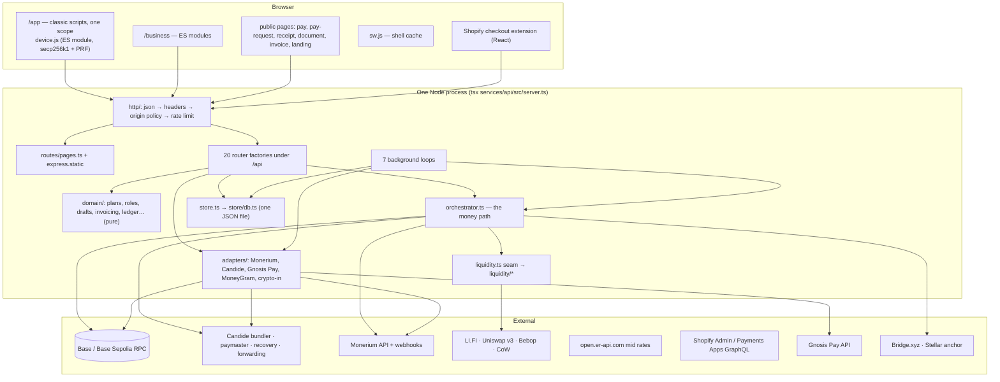
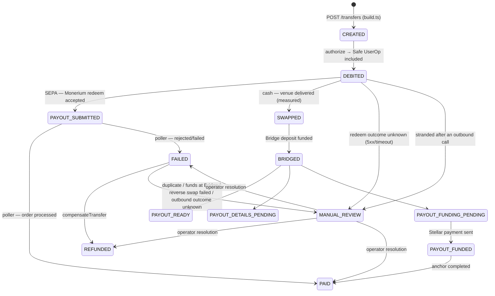
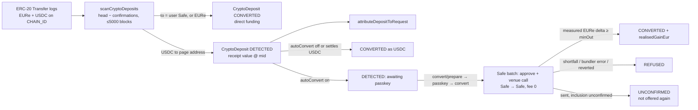

# Zold — technical architecture

*Written from a line-by-line read of `main` at `8dd8009` (2026-09-24). Companion
to [`product-architecture.md`](product-architecture.md), which covers what the
product is. This document covers how it is built. File references are
`path:line` at that commit, and paths under `services/api/src/` are written
without that prefix. §19 lists open code findings.*

---

## 1. System at a glance


```mermaid
flowchart TB
  subgraph Browser
    PWA["/app — classic scripts, one scope<br/>device.js (ES module, secp256k1 + PRF)"]
    BIZ["/business — ES modules"]
    PUB["public pages: pay, pay-request, receipt, document, invoice, landing"]
    SW["sw.js — shell cache"]
    EXT["Shopify checkout extension (React)"]
  end
  subgraph "One Node process (tsx services/api/src/server.ts)"
    PIPE["http/: json → headers → origin policy → rate limit"]
    PAGES["routes/pages.ts + express.static"]
    ROUTERS["20 router factories under /api"]
    DOMAIN["domain/: plans, roles, drafts, invoicing, ledger… (pure)"]
    ORCH["orchestrator.ts — the money path"]
    LIQ["liquidity.ts seam → liquidity/*"]
    ADP["adapters/: Monerium, Candide, Gnosis Pay, MoneyGram, crypto-in"]
    STORE["store.ts → store/db.ts (one JSON file)"]
    LOOPS["7 background loops"]
  end
  subgraph External
    BASE[(Base / Base Sepolia RPC)]
    CAND[Candide bundler · paymaster · recovery · forwarding]
    MON[Monerium API + webhooks]
    VEN[LI.FI · Uniswap v3 · Bebop · CoW]
    RATES[open.er-api.com mid rates]
    SHOP[Shopify Admin / Payments Apps GraphQL]
    GP[Gnosis Pay API]
    BR[Bridge.xyz · Stellar anchor]
  end
  PWA & BIZ & PUB & EXT --> PIPE --> PAGES & ROUTERS
  ROUTERS --> DOMAIN & ORCH & ADP & STORE
  ORCH --> LIQ --> VEN
  ORCH --> BASE & CAND & MON & BR
  ADP --> MON & CAND & GP & BASE
  LOOPS --> ORCH & ADP & STORE
```

- **One process.** It serves the UI, the API and every background loop, and
  keeps the whole database in memory. Several things assume a single instance:
  WebAuthn challenges, in-flight ceremonies, rate-limit counters, Shopify
  install nonces and pending conversions are all process memory. That is a
  deliberate simplification, and it is the first thing to change before
  running more than one instance (§18).
- **No build step.** TypeScript runs through `tsx`. The browser code is served
  as written: classic scripts for `/app`, ES modules for `/business`, and
  vendored `@noble` crypto.
- **Few dependencies.** `express`, `viem`, `abstractionkit` (Candide Safe /
  ERC-4337), `safe-recovery-service-sdk` and `@stellar/stellar-sdk`. There is
  no DB driver, no helmet/cors/rate-limit package, no WebAuthn library (the
  verifier and CBOR decoder in `webauthn.ts` are hand-written) and no test
  framework (`node:assert` plus scripts).

---

## 2. Repository layout

| path | contents |
|---|---|
| `services/api/src/server.ts` | Wiring only (~350 lines): middleware, router mounts, startup checks, loops. **Owns authentication.** Every router is a factory handed `requireSession` / `requireUserSession`. |
| `services/api/src/http/` | `policy.ts` (origin allowlist, security headers, rate buckets), `sessions.ts` (bearer sessions), `guards.ts` (KYC, custody, segment capability, daily cap, operator), `pending.ts` (in-memory ceremony maps). |
| `services/api/src/routes/` | One router per subject. `routes/business/` splits the org surface: `drafts`, `invoices`, `invoicing`, `invoice-links`, `bookkeeping`, `shared`, `state`. |
| `services/api/src/domain/` | Pure rules with no HTTP and no chain: `plans`, `roles`, `segments`, `residency`, `accounts` (currency registry), `contacts`, `drafts`, `invoices`, `invoicing`, `jurisdictions`, `ledger`, `coa`, `passwords`, `types`. |
| `services/api/src/transfers/build.ts` | **The one path that builds a transfer.** It is shared by `POST /api/transfers` and draft execution. |
| `services/api/src/orchestrator.ts` | Execution, debit, compensation and sweeps. Deliberately not split, so it can be read top to bottom. |
| `services/api/src/liquidity.ts` + `liquidity/` | The venue seam, and one file per venue (`best`, `lifi`, `uniswap`, `rfq`, `cow`, `fx-swapper`, `contract`). |
| `services/api/src/adapters/` | Monerium (client, connection, tokens, "sandbox" poller), Candide forwarder, crypto deposits, Gnosis Pay, MoneyGram. |
| `services/api/src/wallet/` | `candide.ts` (Safe accounts, UserOps, EIP-1271 messages, recovery txs), `passkey-safe-plan.ts`. |
| `services/api/src/recovery*`, `recovery/` | Managed and Candide guardian recovery. |
| `services/api/src/stellar/`, `bridge/` | The cash rail: SEP-10/12/24, SEP-9, and Bridge transfers. |
| `services/api/src/shopify/` | Admin/Payments GraphQL client, HMAC, types. |
| `services/api/src/store.ts`, `store/` | `store.ts` holds the methods and is the only code that touches `db`. `store/db.ts` handles load, migrate and persist. `store/types.ts` holds the row shapes. |
| `services/api/src/config.ts` | Every setting, and every production refusal, in one file (~970 lines). |
| `services/api/public/` | `index.html` + `app/*.js` (consumer), `business.html` + `business/*.js`, `admin.*`, public pages, `sw.js`, `device.js`, `vendor/`. |
| `shopify-app/` | Shopify CLI project: `shopify.app.toml` and the `zold-pay` checkout UI extension. |
| `contracts/src/` | `FxSwapper.sol`, `AdminTimelock.sol`, `MockToken.sol`. **Hardhat fixtures only.** On a real chain Zold deploys nothing. |
| `scripts/` | `dev.ts`, `deploy.ts`, `check.ts`, `reconcile.ts`, about 45 test suites, and setup and probe scripts. |

---

## 3. Request pipeline

Order in `server.ts`:

1. `express.json({limit: 64kb, verify})` keeps `req.rawBody` for the Monerium
   and Shopify HMAC checks (`server.ts:59-64`).
2. `securityHeaders` sets `referrer-policy: no-referrer` and
   `x-content-type-options: nosniff` (`http/policy.ts:36-40`). It sets **no
   CSP, HSTS or frame-ancestors**. TLS and HSTS come from the Cloudflare edge.
3. `originPolicy`: an allowlisted `Origin` gets CORS headers. A foreign
   `Origin` on any non-GET request gets 403. A request with no Origin passes,
   which covers webhooks and curl.
4. `trust proxy` is set to `TRUSTED_PROXY_HOPS` (1 behind the tunnel).
5. `/api` rate limit: fixed 60 s windows keyed on IP (IPv6 per /64). There are
   two buckets. **auth** (20/min) covers `/passkey*`, `/webauthn/challenge`,
   `/recovery*`, `/r/`, `/v/`, `/pay/<h>/<code>`, `/shopify/`, `/admin*`,
   `/invoice-links/`, `POST …/monerium/api-keys` and `POST /users`. **general**
   (300/min) covers everything else. `/admin*` with a valid operator token
   has its own **operator** bucket (`OPERATOR_RATE_LIMIT_PER_MIN`, 300/min):
   the dashboard's refresh loop alone sends about 16 a minute; a wrong token
   stays on auth. Matching uses the mount-relative path.
6. The page router serves the HTML routes, then `express.static(public)`. It
   is mounted before any `/api` router.
7. Routers are mounted at `/api`. Mount order matters: the payment-request
   router passes `/pay/:handle/qr.svg` on to the payment-page router.
8. The error handler returns 500 `internal server error`. The raw message is
   shown only when running locally and not in production.

`unhandledRejection` and `uncaughtException` log and **exit the process**.
With in-memory pending executions, an unknown state must not keep signing.

---

## 4. Authentication and authorisation

### 4.1 Sessions

- A session token is an opaque 32-byte base64url bearer
  (`http/sessions.ts:22-30`). The server stores only its SHA-256 hash. The TTL
  is a fixed 24 h (`SESSION_TTL_MS`) with no sliding renewal. `lastUsedAt` is
  written at most once a minute.
- The token travels in the `Authorization: Bearer` header only. There is no
  cookie session. The client keeps it in `localStorage["zold-session"]`.
- Sessions are issued at signup (before any passkey exists), at passkey
  login, and at Candide recovery finalisation.
- `requireUserSession(req, res, userId)` adds a check that the session user is
  the path user. Org routes use `resolveOrg`, which checks session plus
  **active** membership and returns 404 otherwise.
- The operator uses `KYC_OPERATOR_TOKEN` (at least 24 characters) as a bearer,
  compared in constant time. If it is unset the console answers 503 (fails
  closed). It is never a user session.

### 4.2 The three independent checks

| check | where | failure |
|---|---|---|
| who (session) | `http/sessions.ts` | 401 |
| may they, here (member + role → permission) | `routes/org-context.ts` + `domain/roles.ts` | 404 non-member, 403 missing permission |
| did the org buy it (plan capability, limits) | `domain/plans.ts` via `requireCapability` / `requireWithinLimit` | 402 with `requiresPlan`, or 409 `unavailable` |
| may this user use this partner (segment) | `domain/segments.ts` via `http/guards.ts:76-91` | 403 `CAPABILITY_UNAVAILABLE` (audited) |

Permissions are `org.*`, `members.*`, `accounts.*`, `wallets.*`,
`contacts.*`, `drafts.{read,create,review}`, `transfers.{read,execute}`,
`invoices.*`, `ledger.{read,categorise}`, `coa.*` and `reports.run`. Role
sets are cumulative (`domain/roles.ts:39-86`). `transfers.read` and
`org.delete` are defined but checked by no route.

### 4.3 WebAuthn (`webauthn.ts`)

- ES256 and RS256 are verified. The client only requests ES256, and a Safe
  owner must be P-256.
- Challenges are 32 random bytes, single-use, with a 5-minute TTL and at most
  50k held in memory. Each is bound to a **purpose** (`register` / `login` /
  `step_up`) and optionally to a user or `recovery:<id>`. A `step_up` is bound
  to the user AND one action from `STEP_UP_ACTIONS` (routes/auth.ts:
  `passkey.replace`, `monerium.connect`, `monerium.disconnect`,
  `authorizer.bind`, `org.payment-review.off`, `org.invoice-iban.change`), and
  only the route making that change accepts it.
- Registration checks type, challenge, origin allowlist, rpIdHash and the UP
  and UV flags. **Attestation statements are not verified**, so any
  authenticator that verifies its user is accepted.
- Every assertion requires UV: login, `step_up`, and challenges the server
  computed itself (Safe op hashes, SafeMessages). A security key with no PIN
  or biometric can neither register nor sign in. The sign counter must
  advance once it is non-zero.
- `verifyAssertionForChallenge` compares `clientData.challenge` with a
  server-computed hash: a UserOp EIP-712 hash or a SafeMessage hash. That is
  how "the passkey signed *this* debit" is proven server-side before the
  bundler sees it.

---

## 5. Custody: the Safe and the device key

### 5.1 Safe smart account (`wallet/candide.ts`, `wallet/passkey-safe-plan.ts`)

- The account class is abstractionkit's `SafeMultiChainSigAccountV1`
  (ERC-4337), created with `initializeNewAccount([owners], {threshold})`, so
  its address is deterministic and counterfactual.
- **Owner 1** is the passkey, as a WebAuthn owner `{x, y}` taken from the
  P-256 JWK.
- **New Safes are 1-of-1**: the passkey is the only owner (PR #193). No
  allowance module is installed.
- **Gas** (`SAFE_GAS_PAYMENT`, `wallet/candide.ts` `payGas`): `sponsored`
  (Candide paymaster, default), `native` (the Safe's ETH, no paymaster; the
  balance is checked before the passkey signs), or `token` (Candide's token
  paymaster, USDC by default on 8453). Every abstractionkit request carries
  `partnerTimeout()`. `npm run preflight` checks the chosen mode live.
- Recovery guardians go through a SocialRecoveryModule (After3Days by
  default). Deployment installs none: Zoldenburg's guardian is added only when
  the user opts in (`routes/recovery-zoldenburg.ts`), and its key stays on the
  operator's hardware wallet.
- The Safe is deployed as the `initCode` of its first UserOperation. The
  bundler and paymaster default to `https://api.candide.dev/public/v3/<chainId>`
  with an ERC-7677 paymaster, so the user needs no gas. The passkey signs
  `getUserOperationEip712Hash(op, chainId)`. `submitPasskeySafeOperationWithReceipt`
  attaches the passkey assertion, sends the op, and
  **blocks the HTTP request until the op is included**. Every caller checks the
  receipt: a reverted op is refused, and an op sent but not confirmed
  (`SafeOperationUncertainError`) is never recorded as done.
- EIP-1271 messages (`signMessageAsPasskeySafe`) are used for the Monerium
  link declaration, the Monerium redeem order, the Candide SIWE registration,
  and proof-of-ownership documents.
- Local hardhat has no bundler, so Safe deployment is impossible there, and
  the API answers 409 naming the mismatch. `HARNESS.enabled`
  (`LOCAL_HARNESS=1` on 31337 and not production) fakes the op hashes.

#### 5.1.1 Deploy parameters

Values are abstractionkit 0.4.0 defaults for `SafeMultiChainSigAccountV1`. The
init code hash was recomputed from `proxyCreationCode()` read from the factory
on Base. Every contract below has the same address on every chain, so a Safe
address is the same on every chain it is deployed to.

| Contract | Address |
|---|---|
| SafeProxyFactory v1.4.1 (CREATE2 deployer) | `0x4e1DCf7AD4e460CfD30791CCC4F9c8a4f820ec67` |
| Singleton: Safe **L2** v1.4.1 | `0x29fcB43b46531BcA003ddC8FCB67FFE91900C762` |
| Proxy init code hash (with the L2 singleton) | `0xe298282cefe913ab5d282047161268a8222e4bd4ed106300c547894bbefd31ee` |
| Safe 4337 module (enabled module and fallback handler) | `0x22939E839e3c0F479B713eAF95e0df128554AEAd` |
| Safe module setup (`enableModules`) | `0x2dd68b007B46fBe91B9A7c3EDa5A7a1063cB5b47` |
| MultiSend | `0x38869bf66a61cF6bDB996A6aE40D5853Fd43B526` |
| EntryPoint v0.9 | `0x433709009B8330FDa32311DF1C2AFA402eD8D009` |
| WebAuthn shared signer v0.2.1 | `0x94a4F6affBd8975951142c3999aEAB7ecee555c2` |
| WebAuthn signer factory / singleton v0.2.1 | `0x1d31F259eE307358a26dFb23EB365939E8641195` / `0x4E27b51350e6c2083EE19011120F50DAfEc5CA50` |
| P-256 verifiers: RIP-7951 precompile, Daimo fallback | `0x0000000000000000000000000000000000000100`, `0xc2b78104907F722DABAc4C69f826a522B2754De4` |

The singleton is baked into the init code hash, not the initializer. The
Safe **L1** singleton `0x41675C099F32341bf84BFc5382aF534df5C7461a` gives init
code hash `0x76733d705f71b79841c0ee960a0ca880f779cde7ef446c989e6d23efc0a4adfb`
and a different address; it is not what Zold deploys, and vanity miners
often default to it.

Address:

```
initializer = abi.encodeCall(Safe.setup, (owners, threshold, to, data,
              fallbackHandler, address(0), 0, address(0)))
salt        = keccak256(keccak256(initializer) ‖ uint256(saltNonce))
address     = keccak256(0xff ‖ factory ‖ salt ‖ initCodeHash)[12:]
```

Zold always uses `saltNonce` 0 (abstractionkit `c2Nonce`); nothing stores
another value.

`setup()` for a passkey Safe (what `smartAccountForPasskey` deploys):

| Argument | Value |
|---|---|
| owners | `[WebAuthn shared signer]` |
| threshold | `1` |
| to | MultiSend |
| data | `multiSend` of two delegatecalls: module setup `enableModules([4337 module])`, then shared signer `configure({x, y, verifiers})`, where `verifiers` packs the precompile (`0x0100`) above the Daimo verifier |
| fallbackHandler | 4337 module |

The passkey's x/y are in the initializer, so the address is per passkey. After
deployment, signatures from a deployed Safe name the passkey's own verifier
proxy (`passkeyAccountAddress`), not the shared signer (`isInit: !deployed`).

`setup()` for an EOA-owned Safe with the same modules
(`createInitializerCallData([eoa], 1)`, no WebAuthn configuration):

| Argument | Value |
|---|---|
| owners | `[eoa]` |
| threshold | `1` |
| to | module setup |
| data | `enableModules([4337 module])` |
| fallbackHandler | 4337 module |

Such a Safe depends only on the EOA, so its address can be mined before any
passkey exists. Zold adopts one through the import routes (§5.1.2):
`accountForPlan` builds the account from the stored address for an imported
Safe (`importedAt`) as for a recovered one (`recoveredAt`).

#### 5.1.2 Importing an existing Safe (`routes/safe-import.ts`, `wallet/safe-import.ts`, `wallet/safe-tx-builder.ts`)

- `POST /users/:id/safe/import/prepare {address}` checks that the account may
  still switch (a passkey; its own planned Safe not active, not deployed and
  empty) and the Safe's shape, and returns owners, threshold, the passkey's
  verifier, and each owner change (`add`, `swap`) with its Safe{Wallet}
  Transaction Builder file (`txBuilder: {fileName, json}`). It stores nothing.
- `POST /users/:id/safe/import/confirm {address}` reads the chain again,
  deploys the verifier from the deployer if it has no code, and binds the
  account (`passkeySafe.status` `active`, `importedAt`). 201 with the user.
- The Transaction Builder file is built once, in `wallet/safe-tx-builder.ts`;
  `npm run safe:import-tx` writes the same bytes for the same input
  (`safe-import:test` compares them). The browser only downloads it.
- `capabilities().safeImport` is false under the harness, where both routes
  answer `NO_CHAIN`.
- Onboarding (`public/app/onboarding.js`): for a company account with
  `caps.safeImport`, `obCreateAccount` stops after the passkey at
  `b-safe-choice` instead of deploying. "Open a new account" deploys as
  before; "Use our company's existing Safe" runs `b-import-address` (prepare)
  → `b-import-sign` (download, or to/value/data) → `b-import-confirm`
  (confirm, retried by hand). Zold never collects or relays the owner's
  signature; no wallet connection is built.
- `localStorage["zold-safe-import"]` `{userId, address}` marks an import
  started on this device. While it is set, `finishPasskeySafeSetup` refuses
  to deploy and Home offers "Finish bringing in your Safe" instead of
  "Finish smart wallet". It is per device: `prepare` stores nothing, so the
  server cannot know an owner change is on its way. Every screen that reads
  the flag calls `prepare` again.
- An imported Safe is not offered recovery: onboarding skips the step and
  Security says it is not available, because enabling a recovery module has
  never run on one. The recovery routes do not refuse it yet.

### 5.2 Device key (`public/device.js`)

- A secp256k1 key is generated in the browser and stored in
  `localStorage["zold-device-key"]`. It is wrapped with AES-GCM under
  HKDF(WebAuthn PRF output, salt `"zoll/device-key/v1"`) where PRF exists.
  **Do not rename the salt**:
  it is a KDF input.
- It is bound once through `POST /users/:id/authorizer` with a passkey
  step-up. Binding is trust-on-first-use and there is no rotation route.
  Recovery finalisation clears it.
- It signs EIP-712 `PaymentAuthorization {account, amount, to, transferId,
  destination, deadline}` under the domain `{name: "TransF Safe Transfer",
  version 1, chainId, verifyingContract: user Safe}` (`chain.ts:203-238`).
  `destination` is `keccak("sepa|iban=<IBAN>|name=<NAME>")` or the cash
  equivalent. The browser recomputes it and **refuses to sign** if the
  server's typed data names a different destination.
- It is verified **in the API process** (`orchestrator.ts:202-239`), not on
  chain. The chain-enforced guarantee is the passkey-signed UserOp.

---

## 6. The transfer engine

### 6.1 States


```mermaid
stateDiagram-v2
  [*] --> CREATED: POST /transfers (build.ts)
  CREATED --> DEBITED: authorize → Safe UserOp included
  DEBITED --> PAYOUT_SUBMITTED: SEPA — Monerium redeem accepted
  PAYOUT_SUBMITTED --> PAID: poller — order processed
  PAYOUT_SUBMITTED --> FAILED: poller — rejected/failed
  DEBITED --> SWAPPED: cash — venue delivered (measured)
  SWAPPED --> BRIDGED: Bridge deposit funded
  BRIDGED --> PAYOUT_READY
  BRIDGED --> PAYOUT_DETAILS_PENDING
  BRIDGED --> PAYOUT_FUNDING_PENDING
  PAYOUT_FUNDING_PENDING --> PAYOUT_FUNDED: Stellar payment sent
  PAYOUT_FUNDED --> PAID: anchor completed
  DEBITED --> MANUAL_REVIEW: redeem outcome unknown (5xx/timeout)
  DEBITED --> MANUAL_REVIEW: stranded after an outbound call
  FAILED --> REFUNDED: compensateTransfer
  FAILED --> MANUAL_REVIEW: duplicate / funds at Bridge / reverse swap failed / outbound outcome unknown
  MANUAL_REVIEW --> REFUNDED: operator resolution
  MANUAL_REVIEW --> PAID: operator resolution
  MANUAL_REVIEW --> FAILED: operator resolution
```

`store.updateTransfer` refuses to move a `PAID`, `REFUNDED` or `MANUAL_REVIEW`
transfer, or one an operator resolved, to any other state. It drops the
`state` field and logs.

The only way out of MANUAL_REVIEW is `store.resolveTransferReview`, behind
`POST /api/admin/transfers/:id/resolve-review` (operator bearer token, body
`{state: REFUNDED|PAID|FAILED, note, evidence?}`, note 20–2000 characters; the
Transactions view's Resolve button). It moves no money: the operator has
already acted on chain or at the partner. PAID settles linked pay links,
invoices and Shopify orders, so it is refused (409) unless `evidence` names a
payout identifier the transfer recorded: a Monerium order id
(`monerium.redeem.placed`, `sepa.orderId`), a Bridge destination tx
(`bridge.xyz.destination_tx`, `pickup.bridgeDestinationTxHash`) or
`pickup.anchorPaymentHash` (`transfers/review-evidence.ts`). It records
`transfer.reviewResolution` (`state`, `note`, `by` = `operatorLabel`, `at`,
`previousError`, `evidence`) and an `operator.transfer_review_resolved` audit
entry, once per transfer. User-facing transfer routes omit
`reviewResolution` (`transfers/user-transfer.ts`). A resolved transfer is
never compensated or swept, whatever state it holds.

### 6.2 Quote → build → authorize → execute

```mermaid
sequenceDiagram
  participant B as Browser
  participant A as API
  participant C as Candide bundler
  participant M as Monerium
  B->>A: POST /quotes {rail, sendEur}
  A-->>B: quote (10 min TTL; SEPA: 1:1, fee €0)
  B->>A: POST /transfers {quoteId, recipient, IBAN, reference}
  Note over A: build.ts: KYC · balance · Safe active · device key bound<br/>holdDailyCap (sync) · consumeQuote (sync)<br/>auth terms {to, amountWei, destination, deadline+15m}<br/>prepare UserOp (fee transfer, or fee+approve+swap batch)<br/>pendingTransferExecutions[id] (memory)
  A-->>B: transfer + authorization {typedData, safeExecution.challenge, moneriumRedeem.challenge}
  B->>B: device key signs typedData
  B->>B: passkey signs safeExecution.challenge
  B->>B: passkey signs redeem SafeMessage (SEPA)
  B->>A: POST /transfers/:id/authorize
  Note over A: verify execution assertion BEFORE claim<br/>verify redeem assertion → EIP-1271 sig<br/>claimAuthorization (sync, one-shot)
  A->>A: assertDeviceAuthorization (EIP-712)
  A->>C: submit user-signed UserOp
  C-->>A: included → DEBITED
  A->>M: placeOrder(kind: redeem, signature) → PAYOUT_SUBMITTED
```

Build order (`transfers/build.ts:85-411`) runs in this sequence:

1. KYC approved, then Safe balance ≥ send, then `safeDebitBlocker` (an active
   passkey Safe equal to `user.address`), then the early daily-cap check.
2. Device key bound, then `holdDailyCap` (synchronous, taken *before* the
   quote is consumed), then `consumeQuote`.
3. The debit is prepared. **SEPA debits only the fee (€0), so the principal
   is burned by Monerium straight from the Safe.** Cash tries a fused batch
   first: fee transfer, `approve(spender the venue names)`, and a venue call
   delivering USDC to the Bridge deposit address. It falls back to a full
   debit to the orchestrator (`custody: orchestrator`, which
   `REQUIRE_NON_CUSTODIAL=1` turns into a 409).
4. `transfer.custody = {mode, reason?, feeToOrchestrator}` is always recorded.

Draft execution calls the same `buildTransferFromQuote`, which the business
router receives injected and never rebuilds.

### 6.3 Compensation (`orchestrator.ts:382-622`)

- `failAndCompensate` writes FAILED. It escalates to **MANUAL_REVIEW** on a
  duplicate-debit error or once the USDC reached Bridge
  (`bridge.xyz.deposit.transfer`, `.funded` or `destination_tx`).
  Otherwise it compensates.
- An outbound call that may move money records an intent step first:
  `safe.refundTransfer.pending` (refund or reverse swap),
  `monerium.redeem.pending` (settled by `.placed` or `.refused`) and
  `bridge.xyz.deposit.pending`. An intent without a settling step after its
  last occurrence means the money may have moved, and the transfer goes to
  MANUAL_REVIEW, never a refund.
- The two chain writes (refund, Bridge deposit) also settle on a definite
  failure, through `writeAndWait`'s hooks: `<step>.not-sent` only when the
  write threw before any hash with an error that proves the node refused it
  before acceptance (`writeDefinitelyRefused`: viem's InsufficientFunds,
  ExecutionReverted, IntrinsicGas*, FeeCap*, TipAboveFeeCap, NonceTooHigh,
  TransactionTypeNotSupported, or a local account/chain/serialisation error),
  and `<step>.reverted` with the hash when the receipt reverted. Nothing
  moved, so compensation may retry. A bare RPC error (-32603, -1,
  LimitExceeded: viem's transport retries the send on these), a transport
  error, a timeout, a nonce-too-low/"already known" reply, an unknown error,
  or any error after a hash exists settles nothing.
  A reverted Bridge deposit is not a `FUNDS_AT_BRIDGE_STEPS` step.
- `compensateTransfer` runs once per transfer at a time (an in-process set);
  a second call during a running one returns the transfer as it stands. It
  leaves a MANUAL_REVIEW transfer alone.
  - If no input moved, it records a zero refund.
  - If the funds are un-swapped, it returns `min(refund, moved)` EURe to the
    Safe. The `safe.refundTransfer` step is recorded *before* REFUNDED is
    written.
  - If the funds were swapped (non-batch), it reverse-swaps and returns the
    measured EURe.
  - A live batch swap, or any failure of the above, goes to MANUAL_REVIEW.
- SEPA: a Monerium **4xx** refunds the fee. A **timeout or 5xx** goes to
  MANUAL_REVIEW ("redeem outcome unknown").
- Sweeps:
  - `sweepStrandedTransfers` runs at boot and every 5 min and skips any
    transfer being executed or compensated. It re-fails DEBITED/SWAPPED/BRIDGED
    transfers that are stale (more than 10 min), or sends them to MANUAL_REVIEW
    when an outbound intent is unsettled, and sends to MANUAL_REVIEW a CREATED
    transfer whose authorisation was claimed more than 10 min ago.
  - `sweepAnchorPayouts` runs every 30 s.

### 6.4 Invariants encoded here

- A **debit only happens with a user signature**: the passkey signs the
  UserOp hash, and the chain enforces token, amount and recipient.
- **Quote binding**: `assertQuoteRateBinding` refuses when the live venue rate
  drifts more than 50 bps from `lockedSwapRate`. In the batch path it runs
  before the debit. In the non-batch path it runs after, so a drift there
  refunds.
- **Amounts out are measured** as balance deltas (`balanceAfterWrite`,
  12 × 500 ms against RPC replica lag). The exceptions are the hardhat-only
  fx-swapper and non-batch `usdcOut` (§19).
- **Races are closed synchronously** by `claimAuthorization`,
  `claimDraftExecution`, `holdDailyCap`/`addTransferUnderHold`,
  `consumeQuote` and the crypto-deposit identity (`txHash`, `logIndex`). There
  is no `await` between read and write.

---

## 7. FX and liquidity

- **Mid rates** (`rates.ts`) come from `TRANSF_RATES_URL` (default
  open.er-api.com, base EUR). They are cached for 10 minutes, concurrent
  callers share one fetch, and the timeout is 8 s. **There is no stale
  fallback**: an error throws `RateUnavailableError`. Pinned rates
  (`TRANSF_RATES_FIXED`) are refused in production.
- **Sanity**: `assertPriceSane` (`dex.ts:135-159`) refuses a venue price more
  than `DEX_MAX_MID_DEVIATION_BPS` (300) from the mid. It is applied to
  uniswap, lifi, rfq and cow. Crypto-in conversion uses a tighter 100 bps.
- **Venue seam** (`liquidity.ts`): `providerById` **throws** on an unknown id
  and never falls back. A persisted quote is executed on the venue that
  priced it. The default is `LIQUIDITY_PROVIDER=best` over `lifi,dex`.

| venue | quote | execute | Safe-executable | guard |
|---|---|---|---|---|
| **lifi** | `GET li.quest/v1/quote` | approve `approvalAddress` (what LI.FI names), send tx, measure | yes | `LIFI_CONTRACTS` allowlist (Diamond), `value == 0` |
| **dex** (Uniswap v3) | deepest pool across fee tiers, QuoterV2 | `exactInputSingle` via SwapRouter02, measure | yes | router is config, pool pinned on quote |
| **rfq** (Bebop PMM) | `/pmm/<chain>/v3/quote` | maker tx | yes | `BEBOP_CONTRACTS` (empty means execution refused) |
| **cow** | `/api/v1/quote` | **throws, not wired** | no | quote only |
| **fx-swapper** | on-chain `FxSwapper` | `swapExactIn` | no | hardhat only |
| **best** | all venues in parallel, highest `expectedOut` wins, every venue's result recorded | dispatch to the winner | if any is | per venue |

`liquidity/contract.ts` shares the venue guards. `assertVenueTarget` covers
the allowlist, the named spender and zero value. `applySurplus` decides who
keeps positive slippage: the user by default, or the treasury. Either way it
is recorded.

---

## 8. Rails

### 8.1 SEPA via Monerium redeem — built, never executed end to end

- The redeem message is `"Send EUR <amount> to <IBAN> at <rfc3339>"`, signed
  as an EIP-1271 SafeMessage.
- `redeemToIban` re-derives the expected message and refuses on any
  mismatch. It then calls `POST /orders {kind: redeem}` on **the user's own
  Monerium client**. The counterpart name is split on whitespace.
- The memo is `<SEPA-Latin folded reference> Powered by Zold <8 hex>`, at most
  140 characters.
- It is refused **before the fee debit** if `!moneriumLiveFor(user)`.
- Settlement is tracked by `pollRedeemOrdersOnce` every 15 s: `processed`
  becomes PAID, and `rejected`/`failed` becomes FAILED.

### 8.2 Cash rail — closed

`cashRailOpen() = BRIDGE_LIVE && MG_ANCHOR_DOMAIN`. Closed is enforced at the
quote (503 `RAIL_CLOSED`), at execution (before any debit), and in
`/api/health`. When open, the path runs:

1. Batch swap EURe to USDC into a Bridge deposit address.
2. Bridge moves USDC from Base to Stellar, to a static
   `BRIDGE_DESTINATION_ADDRESS`.
3. The Stellar treasury pays the anchor's `withdraw_anchor_account`: SEP-10
   auth, SEP-12 customer, SEP-24 interactive withdraw, and the 9-field SEP-9
   subset MoneyGram needs.
4. The anchor is polled until `completed`.

There is no CCTP code. Only the on-ledger Stellar payment half has ever run
(tx `60528481…`, ledger 3965805).

---

## 9. Monerium integration

| piece | implementation |
|---|---|
| Credentials | Three sources, resolved in `adapters/monerium-connection.ts`: the user's **own API keys** (client credentials), the user's **OAuth tokens**, or **app credentials** from env (only for accounts the app provisioned). |
| OAuth | Authorization Code + PKCE S256. `state` is 24 random bytes. It is **bound to the browser** by an HttpOnly `zold_monerium_connect` nonce cookie (`Path=/api/monerium/oauth`, 10 min, SameSite=Lax), and the server stores the nonce's SHA-256. Refresh uses the same client id, de-duplicated per user. |
| API keys | Validated for shape, then **verified against Monerium before storing**. On success Zold reads context, profiles, IBANs and addresses. An address-matched IBAN approves immediately. |
| Secrets at rest | AES-256-GCM (`crypto-at-rest.ts`) keyed on `MONERIUM_TOKEN_ENCRYPTION_KEY` (also used for Shopify tokens under a domain-separated key). Access and refresh tokens and the API secret are encrypted. With no key, the route answers 503 and never stores plaintext. |
| IBAN activation | The passkey signs the SafeMessage of `LINK_MESSAGE`. The server assembles the passkey's EIP-1271 signature and calls `POST /addresses` then `POST /ibans`. It **only accepts the IBAN whose address is the user's Safe**. It never unlinks, because a wrongly-bound address is "burned" at Monerium (verified live). |
| Deposits | `pollDepositsOnce` every 15 s over the app's profiles and each own-credential user's profile. `mirrorOrder` records processed `issue` orders. The EURe itself is minted straight into the Safe. Each order is also offered to pay-link attribution (code in memo) and invoice attribution (invoice number in memo). |
| Webhook | `POST /api/webhooks/monerium`. It verifies a Standard Webhooks HMAC (`webhook-id.timestamp.body`, `whsec_` key, 300 s tolerance) and de-duplicates by `webhook-id`. It **trusts only the order id** and re-reads that order from Monerium on the app client. Production requires the secret. |
| Reconciler | Every 15 min it compares Monerium's processed issue orders with the mirrored ids and reports `UNMIRRORED` / `PHANTOM`. **It reports, never repairs.** It does not look at transfers, Bridge, redeems or balances. |

---

## 10. Crypto in and conversion (`adapters/crypto-deposits.ts`)


```mermaid
flowchart LR
  LOG[ERC-20 Transfer logs<br/>EURe + USDC on CHAIN_ID] --> SCAN[scanCryptoDeposits<br/>head − confirmations, ≤5000 blocks]
  SCAN -->|to = user Safe, or EURe| CONV1[CryptoDeposit CONVERTED<br/>direct funding]
  SCAN -->|USDC to page address| DET[CryptoDeposit DETECTED<br/>receipt value @ mid]
  DET --> ATTR[attributeDepositToRequest]
  DET -->|autoConvert off or settles USDC| CONV2[CONVERTED as USDC]
  DET -->|autoConvert on| WAIT[DETECTED: awaiting passkey]
  WAIT -->|convert/prepare → passkey → convert| SWAP[Safe batch: approve + venue call<br/>Safe → Safe, fee 0]
  SWAP -->|measured EURe delta ≥ minOut| CONV3[CONVERTED + realisedGainEur]
  SWAP -->|shortfall / bundler error / reverted| REF[REFUSED]
  SWAP -->|sent, inclusion unconfirmed| UNC[UNCONFIRMED<br/>not offered again]
```

- The watched set is every user's Safe, plus each payment-page deposit
  address that is approved with auto-convert on, or that has an open crypto
  pay link.
- The cursor is `${CHAIN_ID}:safe-funding-v1`. It advances only after every
  log in the window is recorded. `(txHash, logIndex)` is the identity, and an
  overlap guard stops concurrent ticks.
- There is no sender screening. The forwarder's second hop (page address to
  Safe) is skipped to avoid double counting.
- The conversion venue must implement `safeSwapPlan`. Otherwise the answer is
  503, never a fallback. The rate is checked against the mid before submit and
  again at settle.
- `sweepPendingCryptoDeposits` re-runs every tick. It rewrites each DETECTED
  row, and if auto-convert is switched off it settles pending deposits as
  USDC.

---

## 11. Payment pages, payment links and receipts

- **Handle** (`pay.ts`): 3–30 characters, lower-case, no `0x`, reserved words
  refused. Claiming one needs a deployed, active passkey Safe. The deposit
  address comes from the Candide forwarding RPC
  (`forwarding_getAddress` + `account_activateForwardingAddress`, salt
  `sha256("transf:payment-page:<userId>:<handle>")`). Activation first asks
  `forwarding_getRoutes` for every source chain and refuses unless each routes
  the app's USDC to the app chain: `forwarding_getAddress` answers for any
  chain id, and Candide routes nothing on any testnet. With no forwarding RPC,
  non-production uses the Safe itself and production throws.
- **QR** (`qr.ts`): a hand-written byte-mode encoder, EC level L, versions
  1–6, rendered as server-side SVG. It carries the bare address because an
  EIP-681 URI with an amount does not fit in v6. It is decoded in tests with
  `jsqr`.
- **Payment requests** (`payment-requests.ts` holds the pure domain,
  `routes/payment-requests.ts` the routes, hooks and sweep):
  - The code is 15 random Crockford characters (75 bits), stored normalised.
  - Crypto quotes: `ceil(cents × usdPerEur × (1 + 50 bps))` micro-USDC, plus
    one micro-unit per collision with the payee's other open quotes. Every
    quote ever shown stays matchable, capped at 24 per link.
  - Matching tiers are full (within 50 bps), then partial (at least 20%), then
    over (up to 10%), then closest, then oldest request.
  - Bank matching looks for the normalised code in a processed Monerium issue
    order's memo, plus a 60 s sweep over the owner's own PAID SEPA transfers
    whose reference carries the code. Twin rows (the Monerium order and our
    own transfer for the same money) are merged.
  - `onPaymentRequestPaid` hooks fire once on the OPEN → PAID edge. The only
    hook is the Shopify resolver.
- **Public projections are allowlists** (`publicPayee`,
  `publicPaymentRequest`, `buildReceipt`, `supplierView`, `publicUser`,
  public documents). A withheld field is absent from the JSON.
  `publicUser` is an allowlist only for the fields it names. Other top-level
  user fields pass through, so new fields are published by default.
- **Receipt shares**: a 75-bit slug, one share per transfer, and re-POST
  edits the share without extending its 30-day TTL. Route hops are derived
  from `txs`, `liquidity`, `sepa` and `pickup`, and anything not actually
  executed is flagged `simulated`.

---

## 12. Shopify

| | custom-app (default) | payments-app |
|---|---|---|
| scopes | `read_orders,write_orders` | `write_payment_gateways,write_payment_sessions` |
| inbound | `POST /api/shopify/webhooks/orders` (`orders/create`, `orders/cancelled`), always answers 200 once verified | `POST /api/shopify/{payment,refund,capture,void}` |
| request | crypto-only pay link, 24 h, `source.kind = shopify` | crypto-only, 1 h, idempotent on session id |
| on PAID | `orderMarkAsPaid` + `metafieldsSet zold.payment` (Admin GraphQL) | `paymentSessionResolve` (Payments Apps GraphQL) |
| refund/capture/void | — | rejected with a merchant-readable reason |

- **Install**: `POST /api/orgs/:orgId/shopify/install` (needs `org.update`)
  keeps an in-memory `state` for 15 min and redirects to Shopify's authorize
  URL. `GET /api/shopify/callback` verifies the query HMAC and the state,
  exchanges the code, encrypts the token, and registers the webhooks or calls
  `paymentsAppConfigure`.
- **HMAC**: the body is checked as base64 HMAC-SHA256 over `rawBody`, and the
  query as hex HMAC over sorted params. Both are constant-time. The shop comes
  from the `shopify-shop-domain` header.
- **Payee**: the backing user of the org's EUR account, or else the
  installer. That user must have a payment page.
- **Buyer lookup**: order ids are per-store sequences, so each order route
  also needs proof that the caller is the buyer. Without it, the answer is the
  same whether the order exists or not.
  - `GET /api/shopify/orders/:shop/:orderId?t=<checkout token>` is CORS `*`
    and no-store. The extension polls it every 4 s. The orders webhook
    stores the SHA-256 of the order's `checkout_token`, and `t` must hash to
    it. It returns the pay-page projection and the pay page's URL.
  - `…/pay?b=<sig>` is a 302 to the pay page, for the confirmation-email
    link. Each store's template has its domain written in, so the email
    needs only `{{ id }}`. `b` is `{{ id | hmac_sha256: key }}`, using a per-shop key
    (`orderLinkSecretEnc`, encryption purpose `shopify-link`) that is created
    the first time the org view shows that store's `payLinkTemplate`.
    **Unverified:** whether Shopify's notification Liquid supports
    `hmac_sha256` (its email-variables reference does not list it). Shopify
    documents that the extension's `checkoutToken` matches the order's
    `checkout_token`; no real store has exercised either.
  - `/return/:code` and `/cancel/:code` redirect back to the store.
- **Extension** (`shopify-app/extensions/zold-pay`): targets
  `purchase.thank-you.block.render` only (the order-status page has no
  checkout token and cannot tell a Zold order from a card one), with `network_access` and a
  single `api_base` setting. It renders the amount, exact USDC, address, an
  EIP-681 QR, and live status. **It has never been built with the Shopify
  CLI, and `client_id` is a placeholder.**
- The mandatory GDPR webhooks and `app/uninstalled` are not handled. That is
  required before any App Store listing.

---

## 13. Organisations, drafts, invoicing and bookkeeping

### 13.1 Org domain

- `Organisation`, `Member`, `Account`, `ImportedWallet`, `Contact`,
  `DraftPayment`, `Invoice`, `ChartAccount`, `AccountRule` and `LedgerEntry`
  are defined in `domain/types.ts`.
- Plans and capabilities: `domain/plans.ts`. `effectivePlan` = the trial's
  `grantsPlan` while the trial is active, else `org.plan`. `can(org, cap)`
  resolves in this order: unknown, then unavailable, then wrong org type, then
  granted, then refused with `requiresPlan`. Limits refuse creates and never
  hide rows. `capabilityMatrix` is served to the client in `publicOrg`.
- Currency registry (`domain/accounts.ts`): **the single place a currency
  becomes real.** `mode()` returns `"live" | false`. EUR is live when Monerium
  OAuth or the encryption key is configured, and every other currency is
  false. `accountIsSpendable` needs both the registry and the row status
  `active`.
- **Monerium profile kind** (`domain/monerium-profile.ts`,
  `adapters/monerium-profile.ts`). A business org's account may only be
  backed by an approved `corporate` Monerium profile, a personal org's by a
  `personal` one (Monerium Personal Terms §16 forbid a personal account for a
  third party's or clients' money). The profile is the backing user's one
  recorded profile (`monerium.profileId`, else `funding.moneriumProfileId`),
  chosen at connect (OAuth callback, `POST /monerium/api-keys`) by
  `pickProfileForSignup` from the signup's `accountType`: `company` takes a
  `corporate` profile, anything else a `personal` one, approved first; a
  profile of the other kind or of no stated kind is never used. No profile of
  the kind refuses `MONERIUM_PROFILE_KIND_MISSING` and stores nothing (OAuth
  redirects to `/app?monerium=refused` and records only
  `User.moneriumRefusal`). Monerium's `/auth` takes no profile kind, so the
  refusal can only come after the user has signed in there; to make it rare,
  `connect/start` prefills Monerium's form with the signup email (`email`)
  and the Monerium screen says which email to use. Linking and activation use the recorded profile;
  a `profileId` in the body that names another answers
  `MONERIUM_PROFILE_NOT_CONNECTED`, and an address-matched IBAN that names
  another profile is not attributed. The profile is read on their own
  credentials: `GET /profiles/:id` for `kind` and `state`,
  and the `GET /profiles?kind=` list for `name`, since the sandbox's
  single-profile answer has no name. Kind and name never come from the client.
  The account list's `adoption` hint judges only the stored profile's kind;
  its stored state can predate Monerium's approval, so the live check at
  adoption decides that. Checked at adoption (`POST /accounts` with adoption, `/fund`), at re-check
  (`/profile-check`) and at execution. Refusals: `MONERIUM_PROFILE_KIND_MISMATCH`,
  `MONERIUM_PROFILE_NOT_APPROVED` (unless the profile is `pending` and a live
  `GET /ibans` lists an approved IBAN on it paying into the backing Safe, the
  same fact that approves the user in `/app`), `MONERIUM_PROFILE_NOT_FOUND` (the login
  cannot see the id; Monerium answers 403), `MONERIUM_NOT_CONNECTED` (409),
  and `MONERIUM_UNREACHABLE` (503, fail closed, nothing written). A pass is
  recorded on `Account.moneriumProfile` (`id`, `kind`, `name`, `checkedAt`),
  and every check, pass or refusal, writes an
  `account.monerium_profile_checked` audit entry. The Beleg names the
  corporate profile as the IBAN holder, and the export's `prepare` answer
  lists `ibanOwners`. A name that differs from `legalName` (normalised for
  case, punctuation and trailing legal forms such as GmbH, UG,
  haftungsbeschränkt) is a warning on the account, never a block. The list's
  `profile` field is derived at read time: a business account adopted before
  the check reads `needs_check` and no row is rewritten. On the hardhat
  harness a user with no Monerium profile stands in with one of the needed
  kind.
- A person has at most one personal org, and a company login none (its Safe
  is the company's): `POST /api/orgs` answers 409 `PERSONAL_ORG_EXISTS` /
  `PERSONAL_ORG_COMPANY_LOGIN`. Signup creates none; `/business` asks a
  person without one to create it (banner, switcher row, prefilled empty
  state). `migrateUsersToOrganisations()` still creates one **at DB load**
  for any user with no membership at all.

### 13.2 Drafts (`domain/drafts.ts`, `routes/business/drafts.ts`, `routes/business/state.ts`)

- The transition table is in `domain/drafts.ts:26-39`. EXECUTED and FAILED
  are **derived on read** from the linked transfers (`withExecutionState`),
  except FAILED on a partial batch failure.
- Fingerprint: `wallet:{chainId}:{address}:{displayName}` or
  `bank:{currency}:{country}:{identifier}:{holderName}`
  (`domain/contacts.ts:162-180`). It is compared at submit, review and
  execute. On drift the draft is parked in INVALID_DATA with `invalidLineIds`.
- Execute runs in this order:
  1. Drift check, then resolve the source account (it must be spendable and
     backed, and **caller = backingUserId**).
  2. Monerium profile, for a business org's account or any account with a
     recorded profile: no record answers 409 `MONERIUM_PROFILE_UNVERIFIED`;
     a connected profile id different from the recorded one answers
     `MONERIUM_PROFILE_CHANGED` without calling Monerium; otherwise the
     profile is re-read and must still have the right kind and be approved.
     Monerium unreachable answers 503. All of this happens before the claim,
     any quote or any fee.
  3. Plan all lines. They must be EUR bank lines above the fee and under the
     cap, or the call answers 422 and creates nothing.
  4. Check the total balance, then take the synchronous claim.
  5. Per line, `createQuote(sepa)` plus the injected `buildTransferFromQuote`.

  The response returns one `authorization` per line to sign.

### 13.3 Invoicing (`domain/invoices.ts`, `domain/invoicing.ts`, `domain/jurisdictions.ts`)

- The invoice state machine is in `domain/invoices.ts` (`TRANSITIONS`).
  Outgoing invoices typed into the editor are written directly in SUBMITTED
  at issue (`routes/business/issue-outgoing.ts`, the one issue path); one
  made from wallet receipts is a DRAFT until it is issued. DELETED is a soft
  state. `syncInvoicePayment` *writes* PAYING → PAID or back to SUBMITTED from
  the linked draft and transfer.
- Arithmetic uses integer cents. VAT is rounded once per rate bucket and
  attributed back to lines by share.
- `checkCompliance` (`domain/invoicing.ts:604-911`) produces errors, which
  block, and warnings, which need `acceptWarnings` and are stored.
- Numbering: the series is `{prefix with {YYYY}/{YY}/{MM}, next, padding}`
  and is unique per org. The series advances only for numbers it generated.
- Settlements are appended by `ref` (`deposit:<id>`, `monerium:<orderId>`)
  and never duplicated. They never change the state.
- Invoice-Me links use a 32-byte token (SHA-256 stored) and an optional
  password (scrypt N=2^15 with a policy check), limited to 10 failures per
  15 min per link.
- **Invoices from wallet receipts** (`domain/income-invoices.ts`,
  `routes/business/income-invoices.ts`). A contact's `payerRule` holds the
  service description, the recipient and the tax line the organisation chose
  (read through `draftFrom`, nothing defaulted), saved with the addresses the
  payer sends from. `planIncomeDrafts` is pure: for one calendar month in
  `org.reporting.timeZone` it takes the inbound wallet rows, names the payer
  (`payerOf`: the contact sync named while it still lists the address, else
  the one contact that lists it now), and per contact with a rule builds one
  DRAFT invoice with one line per receipt (`line.receipt`: row id, block
  time, token, quantity, transaction, EUR cents) and one `wallet-receipt`
  settlement per row (`ref` `ledger:<entryId>`). The draft's total is the sum
  of the rows' `fiatValue`. A row is eligible only with a positive EUR
  `fiatValue` and a transaction hash, and not when tagged or typed internal,
  unlisted or needs-valuation. An eligible row is drafted only while the
  imported wallet it arrived in is proven (§13.5, `walletProof`); otherwise
  it is excluded with the reason (not proven, lapsed, or the wallet no longer
  imported). Every other inbound wallet row of the month is
  accounted for: in the draft's `fromReceipts.excluded` with the reason,
  counted under `withoutRule` or `withoutContact` (valued and `unvalued`),
  under `alreadyInvoiced`, or under `onOtherDrafts`. A row held by a
  non-deleted invoice that the run does not rebuild is never taken again; a
  run rebuilds only DRAFTs of contacts that still have a rule, and writes
  nothing over an invoice past DRAFT. The id is
  `inv_rcpt_` + sha256(org, contact, month, sequence), where the sequence
  counts that payer-month's invoices that are no longer drafts, so a receipt
  arriving after the month was issued gets a further draft. A draft holds 200
  lines (`MAX_RECEIPT_LINES`); the rest are listed as excluded until it is
  issued. With a VAT rate the receipts are the gross: `netLinesFor` finds a
  net total whose net plus VAT, rounded once as `computeTotals` rounds it,
  equals the receipts, and sets `mismatchCents` when none exists. The run
  stores on each draft what the imported wallets' sync state leaves uncertain
  (`syncWarnings`: not synced, last synced before the month ended, booked
  from after the month began, transfers skipped). Read and write happen with
  nothing awaited between, inside `store.batched`.
- **Issuing a draft** (`POST …/income-invoices/:id/issue`) first refuses
  with 409, writing nothing, when a wallet any line came from is not proven,
  then asks each such wallet's chain about its stored proof: 503 when it
  cannot be asked, and a refusal lapses the proof and answers 409. It then
  plans the month
  again and refuses with 409, replacing the stored draft, when the rows it
  bills, their amounts or descriptions, or the rule's `updatedAt` are not the
  ones the stored draft showed. It refuses 422 for a draft with no lines or
  with `mismatchCents`, and 409 for one with `syncWarnings` until the request
  carries `acceptWarnings`. It then calls `issueOutgoing` with the rule's
  template and the draft's lines: the same `draftFrom`, VIES lookup,
  `checkCompliance`, warning acceptance and number series as the editor. The
  request supplies only `acceptWarnings`, `language` and optionally `number`.
  The issue date is the day of issue, the supply period is the month, and
  there is no due date. `issueOutgoing` refuses when the computed gross is not
  the receipts' sum, when the draft's `updatedAt` or state changed across its
  awaits, and (`stillIssuable`, run with nothing awaited before the write)
  when a billed wallet stopped being proven or a billed row's EUR value
  changed meanwhile. The draft becomes SUBMITTED in place and `settlementUpdate`
  closes it PAID from the settlements it carries. A DRAFT is refused by
  payment-link creation, by the deposit-link route and by the invoice-link
  route; `supplierView` passes only a line's printed columns.

### 13.4 Account documents (`documents.ts`, `routes/documents.ts`)

- The snapshot is serialised as canonical JSON and hashed with keccak256.
  The digest is signed with EIP-191 as `"Zold account document <CODE> —
  content digest <digest>"` using `DOCUMENT_SIGNING_KEY`. Production needs
  that key; elsewhere the orchestrator key is used.
- The optional Safe attestation (EIP-1271) is held beside the snapshot and
  checked by `wallet/signature-check.ts`, the one verifier for signed
  messages (also used by the wallet ownership proof). On the hardhat harness
  the document skips it and says so.
- Every `GET /api/v/:code` re-checks the signature and digest and the revoked
  flag, re-reads the balance at the stored block, re-runs the statement
  reconciliation, and verifies the Safe signature.
- Statement opening and closing balances come from `balanceOf` at boundary
  blocks, found by binary search on timestamps.

### 13.5 Bookkeeping (`domain/coa.ts`, `domain/ledger.ts`, `routes/business/bookkeeping.ts`)

- Rule specificity: contact (40), then asset+wallet (30), then wallet (20),
  then asset (10), then default (0), with +1 for an explicit direction.
  `applyRules` skips rows a human categorised (`accountCodeAuto === false`).
- **Cost basis** (`computeCostBasis`, `positions`, `realisedByMonth`). FIFO,
  pooled across the org's imported wallets, per holding: `chainId:token` for
  a wallet row, so two contracts sharing a symbol never share lots, the asset
  for anything else. Quantities are exact (decimal strings read into
  integers at the holding's finest scale), money is integer EUR cents, and a
  partly used lot's cost is split half up with the last piece taking the
  remainder. Not lots: EURe (e-money, by tag or symbol) and fiat assets on
  account rows (the statement lines). An unlisted token is `quantityOnly`.
  Where a transfer's other side is, is decided from the wallets and accounts
  the org has NOW (`ownWallets`, `ownAccounts`), not from the `internal` tag
  sync wrote from the wallets imported then: between imported wallets it
  moves nothing; to the org's Zold account, or tagged internal to an address
  that is neither, it consumes lots at cost into `moved` (`to`), and from
  one it opens a lot with no known cost. A lot from a row with no EUR value has no
  cost. A disposal's `realisedCents` is proceeds minus cost and is ABSENT,
  with `notMeasurable` saying why, when the row has no value, a lot it used
  has no cost, or it sold beyond the booked lots (`shortfall`). A swap is a
  disposal and an acquisition at their own values, not paired; the disposal
  lists the transaction's other rows (`sameTransaction`). `positions` and
  `realisedByMonth` sum only measured gains and count the rest; a sum with
  nothing measured is absent, and so is the cost of a holding none of whose
  units has a known cost. Rows whose amount is not a decimal or whose time
  does not parse are listed in `unreadable`.
- The monthly balance is per month × source × chain × asset. The CSV writer
  guards against formula injection and uses CRLF.
- **`bookkeeping/writer.ts` fills the ledger** through `store.addLedgerEntries`:
  one EUR statement line per economic event (product-architecture §8.3).
- **`wallet-sync/sync.ts` adds the imported wallets' rows** (`source.kind:
  "wallet"`, keyed `wallet:<chainId>:<address>:<tx>:<logIndex>`: the address,
  not the wallet row, so removing and re-importing an address books nothing
  twice). Per wallet a cursor walks windows of at most
  `WALLET_SYNC.maxBlockSpan` (halved while the RPC refuses a range as too
  large), `windowsPerTick` per poll, `confirmations` behind the head, and is
  written with its window's rows. An RPC error, a token read that fails in
  transport, or a price feed / ECB outage HOLDS the window: nothing is
  written, the cursor stays, and the wallet shows the reason with every URL
  removed (`publicSyncError`; an RPC URL carries its key). The first run
  starts at the head, or at the first block of `sync.from`. `getLogs` is
  topic-filtered on the wallet as `to` and as `from`, across all tokens,
  decoded `strict` (NFT transfers drop out). A token whose `decimals()`
  reverts is counted in `sync.skipped`, not booked. A counterparty that is
  another of the org's imported wallets or Zold accounts on that chain makes
  the row `internal_transfer`, which no default rule books. The org's own Zold
  account cannot be imported (409) and is not synced. The RPC's chain id is
  checked against the wallet's every run.
- **Token class** (`wallet-sync/token-class.ts`, `token-lists.ts`): EURe by
  Monerium's contract address per chain (`EMONEY_TOKENS`, plus the app
  chain's deployment) is e-money, booked at par, tagged `e-money`, and
  `computeCostBasis` opens no lot for it. USDC/USDT by address and any token
  on a curated list (`WALLET_SYNC.tokenLists`: Uniswap's and CoinGecko's per
  chain, refreshed daily, a stale copy kept through an outage) is a listed
  virtual asset. Anything else is `unlisted_token`: a quantity row with no
  value, no price call and no default rule. A list that has never loaded
  holds the window; nothing is called unlisted because a host was down.
- **Valuation** (`wallet-sync/valuation.ts`): a USD stablecoin recognised by
  contract address (`USD_STABLECOINS`) is 1 USD; anything else is DefiLlama's
  USD price by chain and address at the block time, refused below
  `minPriceConfidence` or further than `priceSearchWidthSec` from the block.
  Both go through the ECB USD rate for the block's day. A price that does not
  exist (no feed name, no point, low or missing confidence) books
  the row unvalued with `needs-valuation`, and the asset becomes
  `SYMBOL@chain:address`.
- **Revaluation** (`wallet-sync/revalue.ts`). The one way an unvalued wallet
  row gains a value: `valueTransfer` again for its chain, token, quantity
  and block time, with `fresh` so the hour's cached refusal is not the
  answer. It writes `fiatValue`, `fiatRate`, the feed's symbol as `asset`,
  the `revalued` tag, a note and `valuation` (source, ECB day, when, who,
  the previous asset), then re-applies the rules. Refused for a row that is
  not a wallet row, already valued, e-money or unlisted, or held by an
  invoice past DRAFT. The request carries no price. Sync's "Not valued" note
  is replaced; a note a person wrote is kept. The bulk route takes 10 rows
  per call in id order and pages with `after`/`next`, so rows the feed still
  cannot price do not hold back the rest.
- **Ownership proof** (`domain/wallet-ownership.ts`,
  `wallet-sync/ownership.ts`, routes in `routes/orgs.ts`). A challenge
  (random id, 72 h) names the org (legal name and id), the checksummed
  address and the chain id; it is stored on the wallet row, one at a time,
  and spent by the proof it produces (the write re-reads the row inside
  `store.batched`). The check uses only `WALLET_SYNC.rpcs[wallet.chainId]`,
  requires the node to report that chain id, and goes through
  `checkSignedMessage`: code at the address means an `eth_call` of
  `isValidSignature(hashMessage(text), signature)` whose whole first return
  word must be the magic value followed by zeros (a contract echoing its
  calldata is no yes); a revert (code 3, or revert data) is a refusal, a
  node's error without revert data is not. No code or an EIP-7702
  delegation means ECDSA, except on a re-check of an EIP-1271 proof, which is
  then `unverified`. An ERC-6492 wrapper goes to viem's validator while the
  wallet is undeployed, where only a valid answer counts, and is unwrapped
  once it is deployed. The code is read first, so a node that fails is
  `unverified` rather than an ECDSA fallback. The org name in the text is
  folded to one line. Signatures are at most 8 KiB. The proof routes, the
  revalue routes and the receipt-draft issue are in the partner rate bucket. An empty signature is a Safe
  that signed the message on chain. `ownership` keeps the text and
  signature; a re-check the chain refuses sets `lapsed` (owner signatures
  stop verifying after an owner change; a message signed on chain does
  not), one it cannot ask changes nothing. Every attempt writes a
  `wallet.ownership_checked` audit entry. Removing a wallet deletes its row
  and its proof; its rows stay and read as unproven until the address is
  imported again, when rows whose id is that address's row id are pointed at
  the new wallet.

---

## 14. Persistence (`store/db.ts`, `store.ts`, `store/types.ts`)

- **One JSON file** is loaded whole at start and **rewritten whole on every
  write**: `writeFileSync(tmp)` then `renameSync`. There is no locking, so
  there must be one writer process. The path is `TRANSF_DB_PATH`, or
  `data/db.json` for `npm run api`. `npm run dev` uses `data/db.dev.json`,
  which it deletes on each start. Tests use `$TMPDIR/zold-test-db-<pid>.json`.
- Production requires `ALLOW_PLAINTEXT_STORE=1`, which acknowledges the file
  store. Only Monerium tokens and secrets and Shopify tokens are
  field-encrypted. Emails, names, recovery channel targets and IBANs are
  plaintext.
- Collections:
  - users, quotes, transfers, sessions
  - receiptShares, documents, paymentRequests, shopifyConnections
  - processedMoneriumOrders, processedMoneriumWebhooks
  - cryptoDeposits, cryptoDepositCursor
  - audit, recoveryRequests
  - organisations, members, accounts, importedWallets, contacts, drafts,
    invoices, chartAccounts, accountRules, ledger
- Load-time migrations are idempotent:
  - default each collection
  - refuse to boot in production if any user row holds a payment-page private
    key
  - users → personal orgs
  - strip legacy sender profiles
  - default quote status and session expiry
  - prune sessions dead for more than 24 h
- Deletes: none for orgs, accounts, invoices, ledger rows, payment requests,
  receipt shares, documents or audit. **Real deletes exist** for contacts,
  imported wallets, account rules and Shopify connections.
- The audit log is append-only in the same file. Key-name redaction hashes
  PAN, IBAN, token, JWT, API key, password and secret. It is not
  tamper-evident. Recovery events are console logs, not audit entries.

---

## 15. Background loops (all inside the API process, `.unref()`'d)

| loop | interval | does |
|---|---|---|
| `sweepStrandedTransfers` | boot + 5 min | compensate stale transfers, flag claimed-but-unrecorded |
| `sweepCandideRecoveries` | 5 s after boot, then `RECOVERY_SWEEP_MS` (60 s) | expire, then finalise past grace |
| `sweepPaymentRequests` | 60 s | expire; match own SEPA transfers by code; retry Shopify resolves (**uncapped**) |
| `sweepAnchorPayouts` | boot + 30 s | refresh Stellar anchor payouts |
| `reconcile` | 10 s after boot, then 15 min | Monerium drift report (log only) |
| Monerium poller | 15 s | deposits → mirror + attribution; redeems → PAID/FAILED; pending IBANs |
| Crypto-in poller | 15 s | scan logs → deposits → attribution → conversion bookkeeping |

`setInterval` ticks do not wait for the previous tick. Idempotency keys and
overlap guards make that safe.

---

## 16. Browser architecture

### 16.1 `/app` (consumer PWA)

- Script order: an importmap (vendored crypto), then `device.js` (a module,
  deferred), then classic scripts sharing one scope: `core → dashboard →
  transactions → profile → recovery → monerium → onboarding → send → pwa →
  main`.
- **Rule:** every file but `main.js` holds only declarations and event
  wiring, and nothing calls forward into a later file. Anything that awaits
  and then renders lives in `main.js`, because the event loop runs while the
  parser waits on a later script.
- `api()` refuses any path that does not start with `/api/`, so a
  server-supplied `submitTo` cannot redirect the bearer token.
- Capabilities come from `GET /api/health`. They default to *closed* if that
  call fails, and a control is drawn only where the API would accept it.
- A company account's onboarding branches after the passkey: a new Safe, or
  an existing one brought in (§5.1.2).
- `sw.js` (`zold-shell-v4`) handles requests as follows:
  - `/api/*` is network-only, with a synthetic 503 offline.
  - Navigations are network-first. Only SHELL paths are stored, so credential
    URLs (`/r`, `/v`, `/pay/<h>/<c>`) are never cached.
  - Page `.js` and `.css` are network-first.
  - `/vendor`, fonts, icons and the manifest are cache-first.

  Bump `SHELL_CACHE` only when the SHELL list or a vendored file changes.

### 16.2 `/business`

- ES modules. `core.js` is the only writer of shared state (`org`, `view`,
  `token`) and exports setters, because exported bindings are live.
- `shell.js` uses one delegated `[data-act]` click listener, which dispatches
  to `ACTIONS` and then re-renders.
- Navigation is capability-aware only. The role gate is the server's 403.
- A 402 or 409 renders the same upgrade prompt as the nav lock.

### 16.3 Public pages

`pay.html`, `pay-request.html`, `receipt.html`, `document.html`,
`invoice.html` and `landing.html` each fetch one public API. Each starts with
`<!doctype html>`, carries `noindex` where it serves a credential, and uses
only self-hosted fonts.

---

## 17. Extension points (where the next pieces attach)

| to add | attach at | constraints already in the code |
|---|---|---|
| **Ledger writer** — BUILT (`bookkeeping/statement.ts` pure projection, `bookkeeping/writer.ts` store-touching) | attached: `mirrorOrder` and the Monerium poll loops (`keepIssueFacts` → `noteMoneriumIssue`), `settleConvertedDeposit` and the crypto scan, `pollRedeemOrdersOnce` on PAID, and a 60 s sweep in `server.ts` that covers REFUNDED from compensation | keys per event (`statement.key`); `applyRules` on insert; `mergeStatementLines` refreshes facts only and never touches `accountCode`; an org is found through `Account.backingUserId`; a USDC receipt with no ECB rate produces no line. To add an event: a draft in `statement.ts` with a stable key, and a Beleg block in `bookkeeping/beleg.ts` |
| **Beleg** — BUILT (`bookkeeping/beleg.ts`, `issue.ts`, `pdf.ts`) | `issueBelegForLine`; `/v/:code` verifies via `belegStillAgrees`; `/v/:code/beleg.pdf` | a `StoredDocument` of kind `beleg` with `orgId`; one per line, the code written back onto `statement.documentCode` |
| **Monthly export** — BUILT (`routes/business/bookkeeping-export.ts`, `bookkeeping/lexware.ts`, `zip.ts`) | `POST /:orgId/bookkeeping/export/:month/prepare`, then the CSV and ZIP GETs | `export.ledger` + `reports.run` to prepare, `ledger.read` to download; MT940/CAMT would be a sibling of `lexware.ts` |
| **Accounting connector** — GetMyInvoices BUILT (`adapters/getmyinvoices.ts`, `routes/business/integrations.ts`) | `POST /:orgId/integrations/getmyinvoices` (verify + store), `…/push` (a month's Belege), `…/bank-accounts` (read) | key encrypted with purpose `getmyinvoices` under `MONERIUM_TOKEN_ENCRYPTION_KEY`; plan capability `integrations.accounting` plus a 409 without a key; uploads idempotent on the document number, with their own timeout (`GETMYINVOICES.UPLOAD_TIMEOUT_MS`, 120 s; reads 20 s); an upload with no answer (status 0 or 5xx) is looked up again by number and reported `uploaded` + `verifiedAfterTimeout`/`tagsMayBeMissing` or `unknown`, never `failed` and never re-sent; `POST /bankAccounts/{uid}/transactions` exists in their spec and in the client, unused by any route |
| **Exact-output conversion** — venue half BUILT (`LiquidityProvider.safeExactOutputPlan`, dex only; `prepareExactDepositConversion` in `liquidity.ts`) | a `convert/prepare?mode=exact` on the deposit route, and a sweep route that writes `ConversionSweep` rows | fail closed on venues without the method (LI.FI's reverse quote is not exact output); the ceiling is the quoted input plus `DEX_SLIPPAGE_BPS`; the leftover is `CryptoDeposit.leftoverUnits` |
| **Accountant transaction feed** | an org-scoped `GET /api/orgs/:orgId/transactions` checking `transfers.read` | the backing user's transfers and deposits projected through an allowlist; the permission already exists in every role |
| **New currency** | an entry in `domain/accounts.ts` with a real `mode()` | nothing is live without a contracted partner (rule 2) |
| **New venue** | a file in `liquidity/` implementing `contract.ts`, plus `providerById` | an allowlist, a named spender, a measured amount out, `assertPriceSane`, and `safeSwapPlan` if it must be non-custodial |
| **Per-org Safe** | account provisioning in `routes/orgs.ts:431-524` | today `backingUserId` ties spending to one member's device key |
| **Mail transport** | a new adapter | invites, invoice links and recovery all return tokens today; do not add "we emailed them" copy without it |

---

## 18. Configuration, environments and deployment

- `.env` at the repo root is loaded with `process.loadEnvFile` and fills only
  unset variables.
- `TRANSF_CHAIN_ID` defaults to **8453**. The real-money chains are
  {1, 100, 137, 8453, 42161, 59144}. `deployments.json` is keyed by chain
  id. On a real chain it holds only EURe and USDC, and `scripts/deploy.ts`
  deploys nothing there.
- **`assertProductionConfig`** runs when `NODE_ENV=production` or
  `TRANSF_PRODUCTION=1` (`config/production.ts`). It refuses to boot on any of
  the following:
  - Operator token: missing.
  - Harness settings: `KYC_AUTO_APPROVE` or `LOCAL_HARNESS` set, or any dead
    simulation variable present.
  - Chain: a chain that is not real money.
  - Monerium: a sandbox URL or chain name, no OAuth client and no encryption
    key, no webhook secret while app credentials are set, or a non-https
    redirect.
  - Store: `ALLOW_PLAINTEXT_STORE` missing.
  - Bridge: live without a key.
  - Candide: a CANDIDE chain that differs from the app chain, a recovery
    signer without https or a token, the 3-minute recovery module, or no
    no recovery guardian when hosted.
  - Stellar and MoneyGram: the testnet passphrase, or missing MoneyGram
    secrets.
  - WebAuthn: no explicit https `WEBAUTHN_ORIGINS`.
  - Proxy: no `TRUSTED_PROXY_HOPS`.
  - Links: no https `TRANSF_PUBLIC_URL` (absolute links are never built from
    the Host header in production).

| environment | chain | Monerium | db | notes |
|---|---|---|---|---|
| `npm run dev` | hardhat 31337 (spawned) | chain `sepolia` names | `data/db.dev.json`, wiped | the fx-swapper venue; no Safe deploy |
| tests (`npm run check`) | hardhat on free ports | stubs | tmp | 40 offline suites; `draft`, `crypto`, `convert` and `safe-funded` run separately |
| **zoldhq.com (current)** | Base Sepolia 84532 | sandbox, `basesepolia` | `TRANSF_DB_PATH` on the Akash lease's persistent volume | one container on an Akash lease: the API plus `cloudflared` (a dashboard-managed Cloudflare Tunnel); the API binds 127.0.0.1; `RP_ID=zoldhq.com`; `NODE_ENV` is deliberately not production, because it would fail the checks above |
| mainnet | Base 8453 | production | — | never deployed |

`RP_ID` is a one-way door: passkeys are bound to it, and the device key lives
in per-origin localStorage, so accounts do not move between origins.

### 18.1 How zoldhq.com is hosted

The testnet deployment runs on [Akash](https://akash.network), paid from the
Akash Console's managed wallet. There is no image registry: the container
starts from `node:22`, clones this repository, checks out the tip of the
`production` branch (runtime files and prebuilt ABIs only), runs
`npm ci --omit=dev`, writes `deployments.json` from an environment variable,
and starts the API next to `cloudflared`.

- **Ingress is the tunnel, not the provider.** `cloudflared` dials out to
  Cloudflare, so DNS and TLS stay in Cloudflare and the lease can move to
  another provider without a DNS change. The hop from `cloudflared` to the
  API is `http://localhost:3000` inside the container; the visitor's side is
  HTTPS, which is what `WEBAUTHN_ORIGINS` checks. `TRUSTED_PROXY_HOPS=1`.
- **Akash insists on one global port**, so the SDL exposes 3000. Because the
  API binds 127.0.0.1, the provider's public hostname answers 502: there is
  no way in that skips Cloudflare.
- **The provider can read everything.** An Akash provider operator can see
  the container's environment and disk, so every secret the deployment is
  given (Monerium sandbox credentials, the Candide API key, the testnet
  operator keys, the token-encryption key) and the database are readable
  there. Acceptable for a testnet with the Monerium sandbox; not a model for
  real money. The Akash account's own API key is never passed in.
- **A merge to main deploys itself.** The `production` workflow runs
  `npm run check`, rebuilds `production` from the merged commit and pushes
  it. The container asks GitHub for `refs/heads/production` every two
  minutes; when it moves, it copies `/data/db.json` to `/data/backups/`,
  stops the API, checks the new commit out and starts it (about a minute
  without the API). A commit that does not answer `/api/health` within three
  minutes is rolled back to the previous one and skipped. Nothing on GitHub
  holds an Akash credential: the lease pulls, nobody pushes to it.
- **The database lives and dies with the lease.** Closing it deletes every
  account, and passkeys and Safes created there cannot be moved. A deploy
  keeps the lease and its `/data` volume.
- **Deploying sends the secrets, so the operator runs it.** The SDL is
  generated from `.env` on the operator's machine and never committed.
  Provider bids expire within minutes, so creating the deployment and
  accepting a bid happen in one step.

---

## 19. Open code-level findings

These are not security issues (those are reported separately, not committed
here). Each was re-checked against the code on 2026-09-30; unlike the rest of
this document, the paths below are current, not pinned to `8dd8009`. Remove an
item when it is fixed.

1. **Issued invoices are not fully frozen.** `numberSeries.next` can be set
   below numbers already issued (duplicates are caught only at issue). Bank
   and footer blocks are read live from `org.invoicing`, not frozen at issue
   (`routes/business/invoice-links.ts`). An unpaid issued invoice can still be
   soft-deleted.
2. **Invoice-bound pay links only work for the personal org**: the owner
   route passes `defaultOrgId`, so a business-org invoice answers 403
   (`routes/payment-requests.ts`).
3. **CSV-imported draft lines cannot be sent.** The import reads the Safe
   CSV format (recipient address, token, amount), so every line is a wallet
   line, and execute pays only bank lines.
4. **Refund after a non-batch swap** fails through LI.FI or Bebop, which
   refuse any recipient but the orchestrator, and ends in MANUAL_REVIEW. It
   can succeed only when Uniswap wins the reverse quote under `best`.
5. **Amounts not measured.** Non-batch `transfer.usdcOut` is stored from the
   quote, and the refund reads it; the measured amount only sizes the Bridge
   deposit (`orchestrator.ts`). RFQ (`liquidity/rfq.ts`) records no surplus.
6. **The cash batch creates a live Bridge transfer at build time**
   (`transfers/build.ts`) and nothing cancels it, so an abandoned transfer
   leaves an unfunded one. `executeTransfer` passes no sender details, so a
   SEP-12 anchor refuses *after* Bridge holds the funds.
7. **SEPA counterpart `country` is the sender's** (`user.country || "DE"`).
   `sepa.mode` is always the literal `"sandbox"`, so the "Mock SEPA" branches
   in `receipt.ts` and `routes/admin.ts` never run.
8. **Indicative-rate caches never hit**: `providerById` builds a new venue
   per call and `best` re-resolves its venues, so per-instance caches are
   discarded.
9. **Shopify resolve retries are uncapped** (the sweep ignores
   `resolveAttempts`). Shopify webhooks, the checkout-extension poll and the
   pay-page poll (every 5 s) share the auth bucket, 20/min per IP.
10. **`pay-request.html`'s open-amount crypto view stops re-rendering** once
    the payer types an amount — it misses PAID and never re-prices an expired
    quote.

---

## 20. Route catalogue

All paths are under `/api`. **S** = session, **U** = session for `:id`,
**M** = active org member, **P(x)** = permission, **C(x)** = plan capability,
**A** = auth rate bucket.

**Identity**

| | |
|---|---|
| `POST /users` (A) | Signup: segment decided, pending account, session. |
| `GET/DELETE /session` (S) | Read or revoke the session. |
| `POST /webauthn/challenge` (A) | `login` needs no session. `register` and `step_up` need one; `step_up` also needs `action` (400 without a known one). |
| `POST /users/:id/passkey` (U) | Register a passkey. Needs a step-up if one already exists, and then revokes the user's other sessions. |
| `POST /users/:id/passkey-safe/deployment[/:requestId]` (U) | Prepare, then submit, the Safe deploy. |
| `POST /users/:id/safe/import/prepare` (U) | Check a Safe for import; owner changes and Transaction Builder files. Stores nothing. |
| `POST /users/:id/safe/import/confirm` (U) | Bind the account to an existing Safe the passkey's verifier already owns. |
| `POST /passkey/login` (A) | Passkey sign-in. |
| `GET /users/:id` (U) | Account read. |
| `GET /users/:id/kyc` (U) | Account read. |
| `GET /users/:id/bic` (U) | The BIC Monerium lists for the account's IBAN (`GET /ibans`), read once per IBAN and kept as `ibanBic`; `null` when there is no IBAN or Monerium lists none. The account read then carries it as `bic`. |
| `GET /privacy-bundles` | Privacy Bundle catalogue. |
| `POST /users/:id/privacy-bundle[/cancel]` (U) | Subscribe to or cancel the Privacy Bundle. |
| `POST /users/:id/authorizer` (U + step-up) | Bind the device key. |

**Recovery**

| | |
|---|---|
| `GET /users/:id/recovery/candide` (U) | Enrolment state. |
| `POST /users/:id/recovery/candide/{channels, channels/:r/signature, channels/:r/otp, guardian, guardian/:r, cancel, cancel/:r}` (U) | Enrolment and the owner's veto. |
| `DELETE /users/:id/recovery/candide/channels/:reg` (U) | Remove a channel. |
| `POST /recovery/candide` (A) | Recovery from a new device. |
| `POST /recovery/candide/:id/{passkey, otp, finalize}` (A) | Recovery from a new device. |
| `GET /recovery/candide/:id` (A) | Recovery from a new device. |
| `GET /users/:id/recovery` (U) | Managed recovery. |
| `POST /users/:id/recovery/requests` (U) | Managed recovery. |
| `POST /recovery/requests[/:id/{approve,cancel,guardian-submit}]` (operator, A) | Managed recovery. |
| `GET /recovery/requests/:id` (operator or owner, A) | Managed recovery. |

**Money**

| | |
|---|---|
| `POST /quotes` (U, segment `onchain_balance`, KYC; cash gated) | Quote. |
| `POST /transfers` (U) | Build. |
| `POST /transfers/:id/authorize` (U) | Sign and execute. |
| `GET /users/:id/transfers` (U) | Transfer list. |
| `GET /users/:id/activity` (U) | Transfers and deposits. |
| `GET /transfers/:id` (U) | One transfer. |
| `POST /transfers/:id/refresh-payout` (U) | Cash payout refresh. |
| `GET /rates` | Public mid rates. |
| `GET /health` | Block, contracts, capabilities. |

**Monerium**

| | |
|---|---|
| `POST /users/:id/monerium/connect/start` (U, segment) | Start OAuth. Needs a step-up when the account carries a Monerium identity (`carriesMoneriumIdentity`: a connection, an IBAN, approval, or any recorded profile), so only a brand-new account's first connection is session-only. |
| `GET /monerium/oauth/callback` (state + cookie) | OAuth return. |
| `GET /users/:id/monerium/accounts` (U) | Refresh and read the snapshot. |
| `POST /users/:id/monerium/link-signature/start` (U) | Challenge for activation, or for a move with `{purpose: "move-iban", iban}` (bound to that IBAN, single use). |
| `POST /users/:id/monerium/activate` (U) | Link address and request IBAN. Only with the passkey assertion over a pending link-signature request; a finished signature in the body is refused. The challenge is the Safe hash of Monerium's constant ownership message, so only the sign counter tells a replayed assertion from a fresh one. 409 `IBAN_EXISTS_ELSEWHERE` when Monerium answers 304 and the profile's IBANs pay other addresses: `choices: [{iban, address, chain, profileId}]` lists every IBAN on the profile the Safe is linked under, and `existing` is set only when there is exactly one; the user picks, nothing is preselected. 409 `IBAN_EXISTS_UNRESOLVED` when no profile or no IBAN on it can be read. |
| `POST /users/:id/monerium/move-iban` (U, passkey, typed `MOVE`) | Move the user's existing IBAN to the Safe: own connection only, IBAN must be on the profile the Safe is linked under; links the Safe, `PATCH /ibans/{iban}`, approves only if the re-read shows the IBAN on the Safe, else `iban_pending`. Records `moneriumIbanMoves`. 409 `IBAN_NOT_ON_PROFILE` / `ADDRESS_NOT_ON_PROFILE`. |
| `DELETE /users/:id/monerium/connect` (U + step-up) | Forget the connection; revokes the user's other sessions. |
| `POST /users/:id/monerium/api-keys` (U, A) | Connect own keys. On an account that carries a Monerium identity it needs a step-up and revokes the user's other sessions. |
| `DELETE /users/:id/monerium/api-keys` (U + step-up) | Remove own keys; revokes the user's other sessions. |
| `POST /webhooks/monerium` (HMAC) | Webhook. |

**Crypto in**

| | |
|---|---|
| `GET /users/:id/crypto-deposits` (U) | Deposit list. |
| `POST /users/:id/crypto-deposits/:d/convert/prepare` (U) | Price one conversion: `expectedEur`, `minEur`, and `expiresAt` (the end of the signing window). |
| `POST /users/:id/crypto-deposits/:d/convert` (U + passkey) | Convert. |
| `POST /users/:id/crypto-deposits/:d/invoice` (U + member) | Link a deposit to an invoice. |
| `POST /users/:id/auto-convert` (U) | Toggle auto-convert. |

**Get paid**

| | |
|---|---|
| `POST /users/:id/handle` (U) | Claim a handle. |
| `GET /pay/:handle` | Public payee. |
| `GET /pay/:handle/qr.svg` | The payee's QR code. |
| `GET/POST /users/:id/payment-requests` (U) | List or create links. |
| `GET /users/:id/payment-requests/{methods, :reqId}` (U) | Methods; one link. |
| `POST /users/:id/payment-requests/:reqId/cancel` (U) | Cancel a link. |
| `GET /pay/:handle/:code` (A) | Public link. |
| `POST /pay/:handle/:code/quote` (A) | Quote an open-amount link. |
| `POST/GET/DELETE /transfers/:id/share` (U) | Receipt share. |
| `GET /r/:slug` (A) | Public receipt. |

**Documents**

| | |
|---|---|
| `GET /users/:id/documents` (U) | Document list. |
| `POST /users/:id/documents/{receipt, statement, balance, ownership[/:r]}` (U) | Create a document. Balance and ownership only for an approved account (409 `ACCOUNT_NOT_VERIFIED`). The holder name is Monerium's (`users/verified-name.ts`) or carries `nameSource: "self-declared"`, which the page and the ownership text state. |
| `DELETE /users/:id/documents/:code` (U) | Revoke. |
| `GET /v/:code` (A) | Public document with live verification. |
| `GET /v/:code/beleg.pdf` (A) | A Beleg as PDF bytes. |

**Card**

| | |
|---|---|
| `GET /gnosis-pay/config` (S + segment) | Gnosis Pay. |
| `POST /gnosis-pay/siwe/{start, verify}` (S + segment) | Gnosis Pay. |
| `GET /gnosis-pay/{account, transactions}` (S + segment) | Gnosis Pay. |
| `DELETE /gnosis-pay/connection` (S + segment) | Gnosis Pay. |

**Orgs** (`/orgs`)

| | |
|---|---|
| `GET /currencies`, `GET /plans` | Public reference data. |
| `GET/POST /` (S) | List or create orgs. |
| `GET/PATCH /:orgId` (M, P(org.update)) | Read or update the org. |
| `GET /:orgId/plan` (M) | Plan. |
| `POST /:orgId/plan[/trial]` (M, P(org.billing)) | Downgrade, or start the trial. A paid plan answers 402 `PAID_PLAN_NEEDS_GRANT`. |
| `POST /:orgId/payment-review` (P(payments.policy): owners) | `{ required }`. Off needs a fresh passkey step-up (`stepUp`) and works on every plan; on needs C(transfers.approvals). Audited as `org.payment_review_changed`. A plan change away from review records the policy as kept (`domain/payment-review.ts`). |
| `GET /:orgId/members` (M) | Member list. |
| `POST /:orgId/members` (C(members.manage), P(members.invite)) | Invite. |
| `PATCH /:orgId/members/:m` (C(members.manage), P(members.update)) | Change role or status. |
| `POST /invites/accept` (S, email match) | Accept an invitation. |
| `GET/POST /:orgId/accounts` (P(accounts.read / accounts.open)) | List or open accounts. |
| `POST /:orgId/accounts/:a/fund` (P(accounts.open)) | Adopt a funded account. The caller's Monerium profile must be `corporate` for a business org, `personal` for a personal one (§13.1). |
| `POST /:orgId/accounts/:a/profile-check` (P(accounts.open)) | Re-read the backing user's Monerium profile and record it if it passes. |
| `GET/POST /:orgId/payment-requests` (P(invoices.read / invoices.manage)) | List or create the org's payment links. Creating needs the caller's Safe to back the org's account (403 `NOT_THE_PAYEE`). |
| `GET/POST/PATCH/DELETE /:orgId/contacts[/:c]` (P(contacts.*)) | Address book. |
| `GET/POST/DELETE /:orgId/wallets[/:w]` (P(wallets.*)) | Imported wallets. POST takes an optional `syncFrom` day (YYYY-MM-DD, not in the future), which needs `ledger.historicalSync`; without it the wallet is booked from the import on. GET adds `proofState` (`proven`, `lapsed`, `unproven`). |
| `POST /:orgId/wallets/:w/ownership/challenge` (C(wallets.manage), P(wallets.manage)) | Issue the wallet's ownership challenge, replacing a pending one (§13.5). |
| `POST /:orgId/wallets/:w/ownership` (C(wallets.manage), P(wallets.manage)) | Prove the wallet: `{ challengeId, signature? }`. 409 not the current challenge, 410 expired, 422 refused by the chain, 503 not verified. |
| `POST /:orgId/wallets/:w/ownership/recheck` (C(wallets.manage), P(wallets.manage)) | Check the stored proof again; a refusal makes it `lapsed`, 503 changes nothing. |

**Drafts** (`/orgs`)

| | |
|---|---|
| `GET/POST /:orgId/drafts` (P(drafts.read / create)) | List or create drafts. |
| `GET/PATCH /:orgId/drafts/:d` (P(drafts.read / create)) | Read or edit a draft. Editing a waiting or approved draft returns it to DRAFT and clears its review. |
| `POST /:orgId/drafts/:d/submit` (review policy on, or C(transfers.approvals)) | Submit for review. |
| `POST /:orgId/drafts/:d/review` (PENDING_REVIEW, four eyes) | Approve or reject. No plan check: a waiting draft stays reviewable after a downgrade. |
| `POST /:orgId/drafts/:d/cancel` (P(drafts.create) or P(drafts.review)) | Cancel before execution starts: kept as CANCELLED, invoices it was paying are released. 409 from EXECUTING on. |
| `POST /:orgId/drafts/:d/execute` (P(transfers.execute), backing user) | Execute. Sends only REVIEWED while the review policy is on; refused if the draft was written while it was being planned. |
| `POST /:orgId/drafts/import-csv` (C(transfers.bulkCsv)) | Parse CSV lines. |

**Invoices** (`/orgs`)

| | |
|---|---|
| `GET/POST /:orgId/invoices` (C(invoices)) | List invoices or create an Invoice-Me link. |
| `DELETE /:orgId/invoices/:i` (C(invoices)) | Soft delete. |
| `POST /:orgId/invoices/:i/{pay, reconcile}` (C(invoices)) | Pay via a draft, or reconcile by hand. |
| `GET/PATCH /:orgId/invoicing/profile` (C(invoices)) | Invoicing profile. |
| `POST /:orgId/invoicing/{check, issue}` (C(invoices)) | Compliance dry run, or issue. `language` (`de`/`en`) and `dueDate` may be set per invoice; the profile's language and payment terms are the defaults. |
| `PUT/DELETE /:orgId/contacts/:c/payer-rule` (C(invoices), P(invoices.manage)) | Set or remove a contact's payer rule; PUT may carry `wallets`, saved with it. |
| `POST /:orgId/income-invoices/run` (C(invoices), P(invoices.manage)) | Collect a month's wallet receipts into draft invoices. `{ month: "YYYY-MM" }`, not a future month. |
| `POST /:orgId/income-invoices/:i/issue` (C(invoices), P(invoices.manage)) | Issue a draft made from receipts. |
| `GET /invoice-links/:token` (A) | Supplier side. |
| `POST /invoice-links/:token/submit` (A) | Supplier side. |

**Books** (`/orgs`)

| | |
|---|---|
| `GET/POST /:orgId/chart-of-accounts` (C(coa.manage)) | Chart of accounts. |
| `POST /:orgId/account-rules[/apply]` (C(coa.rules)) | Add a rule, or re-run rules. |
| `GET /:orgId/ledger` (C(ledger.transactions)) | Ledger. |
| `PATCH /:orgId/ledger/:e` (C(ledger.transactions)) | Categorise a ledger row. |
| `GET /:orgId/assets` (C(assets.costBasis), P(ledger.read)) | Holdings per token with their lots, disposals, moves to the Zold account, shortfalls, quantity-only tokens, unvalued rows and each wallet's proof state. |
| `GET /:orgId/reports/realised-gains` (C(assets.costBasis), P(ledger.read)) | Measured gains and losses per month in the reporting time zone, with every disposal. |
| `POST /:orgId/ledger/:e/revalue` (C(ledger.transactions), P(ledger.categorise)) | Ask the price feed again for an unvalued wallet row. 409 not revaluable, 422 still no price, 503 feed or ECB down. |
| `POST /:orgId/ledger/revalue` (C(ledger.transactions), P(ledger.categorise)) | The same for every unvalued wallet row, 100 per call. |
| `GET /:orgId/reports/monthly-balance` (C(reports.monthlyBalance)) | Monthly balance report. |
| `GET /:orgId/export/ledger.csv` (C(export.ledger)) | Ledger CSV. |
| `GET /:orgId/bookkeeping/statement[?month=]` (C(ledger.transactions)) | Statement lines: one per economic event, with links and Beleg codes. |
| `POST /:orgId/bookkeeping/statement/rebuild` (C(ledger.transactions), ledger.categorise) | Re-run the ledger writer for the org's accounts. |
| `POST /:orgId/bookkeeping/export/:month/prepare` (C(export.ledger), reports.run) | Issue the month's missing Belege. |
| `GET /:orgId/bookkeeping/export/:month/lexware.csv` (C(export.ledger)) | Lexware Office bank-import CSV. |
| `GET /:orgId/bookkeeping/export/:month/belege.zip` (C(export.ledger)) | ZIP of the month's Belege. |
| `POST /:orgId/bookkeeping/lines/:lineId/beleg` (C(export.ledger), reports.run) | Issue one line's Beleg. |
| `GET /:orgId/integrations` (org.read) | Connector state; never a key. |
| `POST/DELETE /:orgId/integrations/getmyinvoices` (C(integrations.accounting), org.update) | Verify and store, or remove, the org's GetMyInvoices key. |
| `GET /:orgId/integrations/getmyinvoices/bank-accounts` (C(integrations.accounting)) | Their bank accounts, read only. |
| `POST /:orgId/integrations/getmyinvoices/push` (C(integrations.accounting), reports.run) | Push a month's Belege; idempotent on the document number. Per line: `uploaded`, `exists`, `unknown` (no answer, not found after), `no-beleg` or `failed` (refused). |

**Shopify**

| | |
|---|---|
| `GET /orgs/:orgId/shopify` (P(org.read)) | Merchant view. |
| `POST /orgs/:orgId/shopify/install` (P(org.update)) | Start install. |
| `DELETE /orgs/:orgId/shopify/:id` (P(org.update)) | Disconnect. |
| `GET /shopify/callback` (HMAC + state) | OAuth return. |
| `POST /shopify/{payment, refund, capture, void}` (HMAC) | Payments-app sessions. |
| `POST /shopify/webhooks/orders` (HMAC) | Custom-app order webhooks. |
| `GET /shopify/orders/:shop/:orderId[/pay]` | Buyer lookup; needs the checkout token (`t`) or the email signature (`b`). |
| `GET /shopify/{return, cancel}/:code` | Redirect back to the store. |

**Operator**

| | |
|---|---|
| `GET /admin/{stats, overview, issues, users, transactions, errors}` (operator token, A) | Dashboard reads; derived views in `src/admin/`. |
| `GET /admin/users/:id` (operator token, A) | One account: projection, onboarding stage, transactions, recoveries, issues, audit. |
| `GET /admin/users/:id/monerium[?live=1]` (operator token, A) | What Zold stored from Monerium; `live=1` also reads Monerium on the account's own connection (refused without one), stores nothing, audits the read. |
| `GET /admin/monerium[?live=1]` (operator token, A) | Deployment-wide Monerium view; `live=1` checks the app credentials. |
| `GET /admin/recoveries` (operator token, A) | Zoldenburg requests and guardian enrolments. Each request's account carries `moneriumProfileHistory`, every Monerium profile it recorded (append-only, store.updateUser). |
| `POST /admin/orgs/:orgId/plan` (operator token, A) | Grant a plan. The only way onto a paid plan while there is no billing. |
