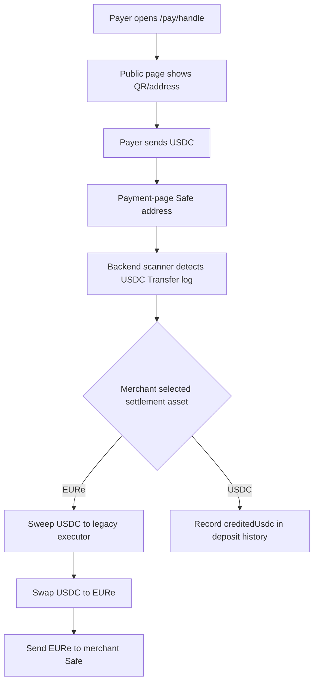
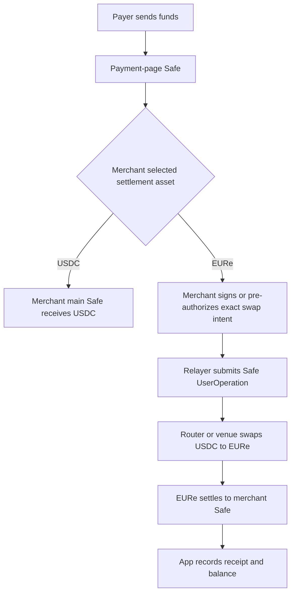

# Payment Page Architecture Map

This document explains the payment page architecture in product terms. It is
written for public-testing decisions, not as legal advice.

## The Actors

| Name | Meaning |
|---|---|
| Payer | The customer or sender who opens `/pay/<handle>` and sends crypto or fiat. |
| Merchant | The TransF end user who created the payment page and receives settlement. |
| Payment page | The public link and QR/address the payer uses. |
| Payment-page Safe | The receive account for one payment page. |
| Merchant main Safe | The merchant's own wallet/account. This should be the final owner of settled funds. |
| Relayer | Backend service that prepares transactions, sponsors gas, scans deposits, and reports status. |
| Legacy orchestrator | Backend/operator wallet used by old flows to move funds and execute swaps. This should be removed from client-fund movement. |
| Removed RemitVault | Abandoned contract-backed EUR ledger. The Safe is now the account of record. |

## The Goal

The intended product is:

1. The merchant creates a payment page.
2. The payer can pay with crypto or fiat.
3. The merchant chooses a settlement asset: `EURe` or `USDC`.
4. Incoming funds are automatically settled into that chosen asset.
5. Funds end up in the merchant Safe, or in a clearly disclosed regulated
   partner account when the merchant chooses that product path.

## Current Payment Page Flow



The important gap is the `USDC` branch. It records settlement in app state, but
there is no separate USDC ledger and no transfer from the payment-page Safe to
the merchant main Safe.

## What The Orchestrator Does Today

The current orchestrator is more than a message relay in some flows:

- It can receive funds as working capital for execution.
- It executes swap/liquidity operations.
- It interacts with bridge/payout contracts.
- In some transitional Safe flows, the backend still relies on server-held
  signing material to move funds.

That is useful for a demo and for proving the product mechanics, but it is not
the target architecture. If the Safe already owns the user's account logic, then
client funds should not move through a separate operator wallet.

## Why RemitVault Was Removed

`RemitVault` was useful when the app needed an internal EUR ledger and the Safe
was not yet the main account. After passkeys and Safe modules, the Safe is the
source of truth:

- EURe balance should be the merchant Safe's token balance.
- USDC balance should be the merchant Safe's token balance.
- Transfer permissions should be Safe/module permissions.
- Daily limits and one-time authorizations should live in Safe modules, signed
  Safe operations, or small policy contracts called by the Safe.
- Receipts can live in app state, but funds should not have to land in app
  custody before the user can spend them.

So the target is not "rename RemitVault". The target is Safe-owned funds
end-to-end; receipts can live in app state, but spendable value lives in Safes.

## Why This Can Look Custodial

The risk is not the name "orchestrator". The risk is control.

If the backend can move client funds because it stores a private key, controls a
deposit Safe owner, or receives funds into an operator wallet before settlement,
then the system can look custodial.

For a MiCA-sensitive launch, the safer rule is:

- The backend may observe, prepare, relay, sponsor gas, and reconcile.
- The backend should not be able to freely move merchant or payer funds.
- Any automated movement should be constrained by a user-signed intent or smart
  contract policy.

## Safer Target Architecture



In this model, the backend becomes a relayer. It can help execute the merchant's
authorized instruction, but it cannot redirect funds or move them without the
merchant's permission.

## USDC Settlement Target

If the merchant chooses `USDC`, the clean product behavior is:

1. Payer sends USDC to the payment-page Safe.
2. The app detects the deposit.
3. The merchant-owned Safe moves USDC to the merchant main Safe, or the page Safe
   itself is shown as a spendable merchant wallet with withdrawal controls.
4. The app records the receipt.

The first public version should probably use the merchant main Safe as the
destination, because it is easiest for users to understand:

```text
Payment page receives funds -> merchant wallet owns funds
```

## EURe Settlement Target

If the merchant chooses `EURe`, there are two acceptable target shapes:

### Non-custodial Shape

1. Payer sends USDC to the payment-page Safe.
2. Merchant signs a swap intent or Safe UserOperation.
3. Relayer submits the operation.
4. Swap executes with fixed constraints:
   - source token
   - source amount
   - minimum EURe out
   - destination
   - expiry
   - quote id
5. EURe goes to the merchant main Safe.

### Regulated Partner Shape

1. Payer sends funds to a partner-controlled or partner-compliant account.
2. The partner performs conversion and settlement.
3. TransF records the result and provides UX/reconciliation.

This can be simpler operationally, but it depends on partner permissions and
legal structure.

## What To Avoid Before Real Public Testing

- Server-held payment-page private keys.
- Counterfactual page Safes that are shown to payers before deployment.
- USDC settlement that only writes `creditedUsdc` into history.
- Funds swept into an app/operator wallet.
- EURe routed into an internal vault for payment-page settlement.
- Marketing the page as private when each handle resolves to one public address.
- Open real-money auto-convert without compliance review.

## Recommended Public Testing Plan

### Testnet Public Demo

Allowed:

- Current contracts on a public testnet.
- Test USDC and test EURe.
- Public payment-page UX.
- Clear copy that funds are test assets.

### Closed Real-Money Beta

Do first:

- Deploy payment-page Safes before showing them.
- Remove server-held page private keys from production.
- Make USDC settlement actually move to a merchant-controlled Safe.
- Make EURe settlement swap inside the Safe and land in the merchant Safe.
- Disable auto-convert until user-signed intent exists.
- Add operational monitoring for stuck deposits.

### Open Real-Money Public Test

Do first:

- Legal/compliance review for MiCA/CASP exposure.
- Decide whether conversion is non-custodial or done by a regulated partner.
- Ensure the backend is a relayer, not a custodian.
- Ensure the merchant Safe is the balance of record.
- Publish user-facing terms that match the actual custody model.

## Near-Term Code Changes

1. Add payment-page Safe deployment before a page becomes publicly payable.
2. Replace `paymentPage.depositPrivateKey` with merchant-controlled ownership.
3. Change USDC settlement from "record only" to a real movement into the
   merchant Safe.
4. Change EURe settlement from "sweep to legacy executor" to "swap from Safe,
   settle to merchant Safe".
5. Keep remittance funding on `safeBalanceEur`.
6. Replace app-state replay/daily-limit checks with Safe/module or
   policy-contract checks.
7. Rename custody-sensitive backend paths from "orchestrator" to "relayer" only
   after the code actually behaves as a relayer.
8. Add tests proving:
   - USDC lands in the merchant-controlled destination.
   - EURe conversion cannot change destination or min-out.
   - production cannot create state that production startup later rejects.
   - remittance sends spend from the Safe.

## One-Sentence Architecture

The payment page should be a merchant-controlled receive account with automatic
settlement instructions, and the merchant Safe should be the account of record;
the backend should relay and reconcile those instructions without taking control
of client funds.
